# Snoopy Workplace

**People, Learning & Work Hub** — a proof of concept for managing employees,
courses, tasks, events, documents and HR onboarding in one place.

It has two audiences. **HR** runs the workplace — assigning training, asking for
documents, checking certificates, and answering for the record afterwards.
**Employees** supply most of what is in that record, and are the half not sitting
at a desk. Each gets its own client, and the two share one backend:

- **Mobile** — React Native + Expo. The employee's companion: *"help me get my work done."*
- **Desktop** — Next.js + React. HR's workspace: *"help me run the workplace."*

They are deliberately not the same product with different padding. The mobile app
is built for short, touch-first sessions on personal work; the desktop app is built
for tables, filters, bulk operations and reporting.

---

## Contents

**Getting it running** — [Requirements](#requirements) · [Getting started](#getting-started) · [Migrations and seed data](#migrations-and-seed-data) · [Run both apps together](#run-both-apps-together) · [Demo accounts](#demo-accounts) · [Screenshots](#screenshots) · ["Cannot reach the server"](#cannot-reach-the-server)

**Compliance and security** — [Australian employment record obligations](#australian-employment-record-obligations) · [The documents are real](#the-documents-are-real) · [Pay records and pay slips](#pay-records-and-pay-slips) · [Where a payroll engine plugs in](#where-a-payroll-engine-plugs-in) · [Contractors, and who is actually an employee](#contractors-and-who-is-actually-an-employee) · [Are we a small business employer?](#are-we-a-small-business-employer) · [Casuals asking to become permanent](#casuals-asking-to-become-permanent) · [The policies an employer must have in writing](#the-policies-an-employer-must-have-in-writing) · [The breach register](#when-something-goes-wrong-the-breach-register) · [Zero Trust, and where it actually bites](#zero-trust-and-where-it-actually-bites) · [One history, both apps](#one-history-both-apps) · [Session and activity monitoring](#session-and-activity-monitoring) · [Row Level Security](#row-level-security)

**How it is put together** — [Architecture](#architecture) · [Repository layout](#repository-layout) · [Ownership model](#ownership-model) · [Row Level Security](#row-level-security) · [Roles and permissions](#roles-and-permissions) · [Platform capability strategy](#platform-capability-strategy) · [Monorepo notes](#monorepo-notes) · [Conventions](#conventions)

**What the phone does** — [Who opened my files](#who-opened-my-files) · [What needs you, on a phone](#what-needs-you-on-a-phone) · [Returning what was asked of you](#returning-what-was-asked-of-you) · [Offering a certificate from the phone](#offering-a-certificate-from-the-phone) · [Uploading a document, with its details](#uploading-a-document-with-its-details) · [A manager's team, read-only](#a-managers-team-read-only)

**What it does** — [Reading a document without leaving](#reading-a-document-without-leaving) · [Progress and analytics](#progress-and-analytics) · [Required training](#required-training) · [Notifications](#notifications) · [Deadlines, reminders and handover](#deadlines-reminders-and-handover) · [What needs you](#what-needs-you) · [Clearing the queue in batches](#clearing-the-queue-in-batches) · [Adding somebody, in one submit](#adding-somebody-in-one-submit) · [Optional credentials, and who could cover what](#optional-credentials-and-who-could-cover-what) · [Asking for documents, and getting them back](#asking-for-documents-and-getting-them-back) · [Managers, evidence and leaving](#managers-evidence-and-leaving) · [One person's history](#one-persons-history) · [Saved views](#saved-views) · [Reminders that leave the building](#reminders-that-leave-the-building) · [Reminders that reach a shut phone](#reminders-that-reach-a-shut-phone) · [Dark mode](#dark-mode)

**Shipping** — [Testing and validation](#testing-and-validation) · [Performance notes](#performance-notes) · [Installable web app](#installable-web-app) · [One link, two apps](#one-link-two-apps) · [Deploying to Vercel](#deploying-to-vercel)

**Screenshots and reports** — [`docs/screenshots/`](docs/screenshots) holds live captures of both clients. [`docs/mobile-companion-report.md`](docs/mobile-companion-report.md) (and its [PDF](docs/mobile-companion-report.pdf)) is a written report on what a phone-first companion should and should not do, drawn from this codebase.

---

## Architecture

```
                         Snoopy Workplace
                                │
             ┌──────────────────┴──────────────────┐
             │                                     │
      Mobile (Expo)                        Desktop (Next.js)
      Touch-first, personal                Management-first, dense
             │                                     │
             └──────────────────┬──────────────────┘
                                │
                       packages/shared
        types · services · validation · permissions · utils
                                │
                             Supabase
                                │
              ┌─────────────────┼─────────────────┐
             Auth          PostgreSQL          Storage
                                │
                               RLS
```

One database, one auth system, one storage bucket, one set of business rules.
Only the presentation and the platform-appropriate capabilities differ.

### Repository layout

```
apps/
  desktop/            Next.js App Router workspace
    src/app/          routes (login, dashboard, courses, tasks, …)
    src/components/   UI kit, forms, dialogs, drawn icon set
    src/lib/          Supabase clients, session, server actions
  mobile/             Expo Router application
    app/              routes (tabs, detail screens)
    src/components/   UI kit and icons
    src/lib/          Supabase client, auth context, data hook
    src/theme/        palette, spacing, light and dark themes
packages/
  shared/src/
    types.ts          domain model
    capabilities.ts   role × platform × permission capability system
    validation.ts     zod schemas shared by both clients
    services/         every Supabase query in the product
    utils.ts          formatting, storage paths, error messages
supabase/
  migrations/         schema, RLS, analytics views, storage, roles
  seed.sql            two organisations of realistic demo data
scripts/
  dev-port.mjs        starts a dev server on the first free port
```

---

## Requirements

- Node.js 20+
- Docker Desktop (for local Supabase)
- Supabase CLI (`npx supabase` works without a global install)
- Xcode or Android Studio, or the Expo Go app, to run the mobile client

---

## Getting started

```bash
npm install
npx supabase start      # first run pulls images and takes a few minutes
```

`supabase start` prints your local URL and anon key. Copy them into the two
environment files:

```bash
cp .env.example apps/desktop/.env.local
cp .env.example apps/mobile/.env
```

| Variable | Used by | Notes |
|---|---|---|
| `NEXT_PUBLIC_SUPABASE_URL` / `NEXT_PUBLIC_SUPABASE_ANON_KEY` | desktop | public, safe in the browser |
| `SUPABASE_SERVICE_ROLE_KEY` | desktop, server only | creating and inviting users; never sent to the browser |
| `EXPO_PUBLIC_SUPABASE_URL` / `EXPO_PUBLIC_SUPABASE_ANON_KEY` | mobile | public |

Credentials are never hardcoded — both clients read them from the environment
and fail with a clear message if they are missing.

### Migrations and seed data

```bash
npm run db:reset        # applies every migration, then seeds demo data
```

### Run both apps together

```bash
npm run dev             # desktop + mobile in one terminal
```

Output from each server is prefixed with its name, and Ctrl-C stops both — the
runner (`scripts/dev-all.mjs`) puts each server in its own process group, so
nothing is left holding a port. If one server exits on its own the other is
stopped too, rather than leaving half a stack running. Ports are still chosen by
`scripts/dev-port.mjs`, so a busy 3100 or 8081 simply moves along.

Run them separately with `npm run dev:desktop` and `npm run dev:mobile`.

### Run the desktop app

```bash
npm run desktop         # http://localhost:3100
```

If the port is taken the dev server moves to the next free one automatically
(`scripts/dev-port.mjs`) and prints where it landed.

### Run the mobile app

```bash
npm run mobile          # Expo dev server, then press i / a, or scan the QR code
```

### "Cannot reach the server"

This is a *reachability* message, not a dead backend. A loopback URL means "this
machine", which is true for the machine running the stack and false for every
other device — on a phone, `127.0.0.1` is the phone.

Both clients now resolve the backend against the host the app was served from
(the page host on web, the packager host on a device), so `.env` can keep
loopback and a phone on the same Wi-Fi still works. A hosted `*.supabase.co` URL
is never rewritten, so production is unaffected.

If it still appears, in order:

1. **Different networks.** Phone and laptop must share one Wi-Fi. The LAN address
   changes when you move networks — `ipconfig getifaddr en0` shows the current one.
2. **Backend not running.** `npm run db:start`, and check
   `curl http://<your-lan-ip>:54321/auth/v1/health` returns 200 from the laptop.
3. **A firewall or "private network" prompt** blocking ports 54321 / 8081.
4. **A hosted backend that is paused** — free Supabase projects sleep when idle.

Pressing `w` opens the **mobile** app in a browser through `react-native-web`.
That is a convenience for checking phone layouts without a simulator — it is not
the desktop product. The desktop workspace is the Next.js app on port 3100, and
the two are deliberately different interfaces over the same backend.

---

## Demo accounts

Password for every account: `snoopy123`

| Person | Organisation | Role |
|---|---|---|
| lucy@peanutsstudio.test | Peanuts Creative Studio | Administrator |
| charlie@peanutsstudio.test | Peanuts Creative Studio | Employee |
| schroeder@peanutsstudio.test | Peanuts Creative Studio | Employee |
| patty@peanutsstudio.test | Peanuts Creative Studio | Employee |
| sally@woodstockdigital.test | Woodstock Digital | Administrator |
| linus@woodstockdigital.test | Woodstock Digital | Employee |

Sign in as Lucy and Linus side by side to see tenant isolation: neither can see
the other organisation's employees, courses, tasks, documents or onboarding.

Invitation emails sent from **Settings → Users** are captured locally by Mailpit
at <http://127.0.0.1:54324>.

---

## Screenshots

Live captures from a seeded local workspace — phone at 390 × 844, desktop at
1440 × 900. Everything in [`docs/screenshots/`](docs/screenshots).

**The phone app** — an employee's own obligations, and nothing organisational.

| Home | Courses | Documents |
|---|---|---|
| 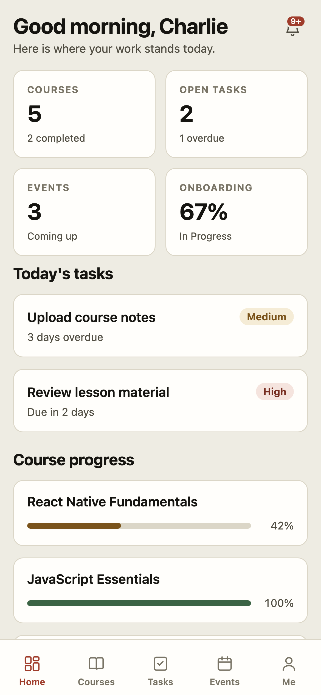 | 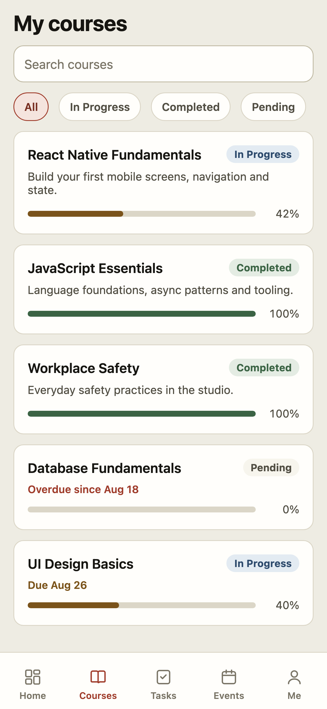 | 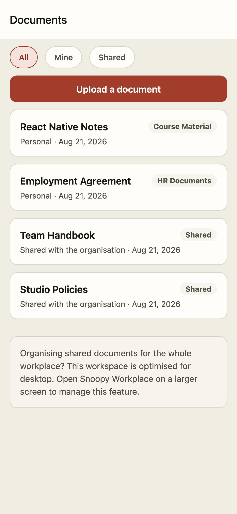 |

The documents screen carries the pattern this codebase uses everywhere a phone
cannot do something: the feature is shown, the boundary is named, and the app
says where the work lives — rather than hiding it, or letting it fail.

**The desktop workspace** — one queue and twelve reports.

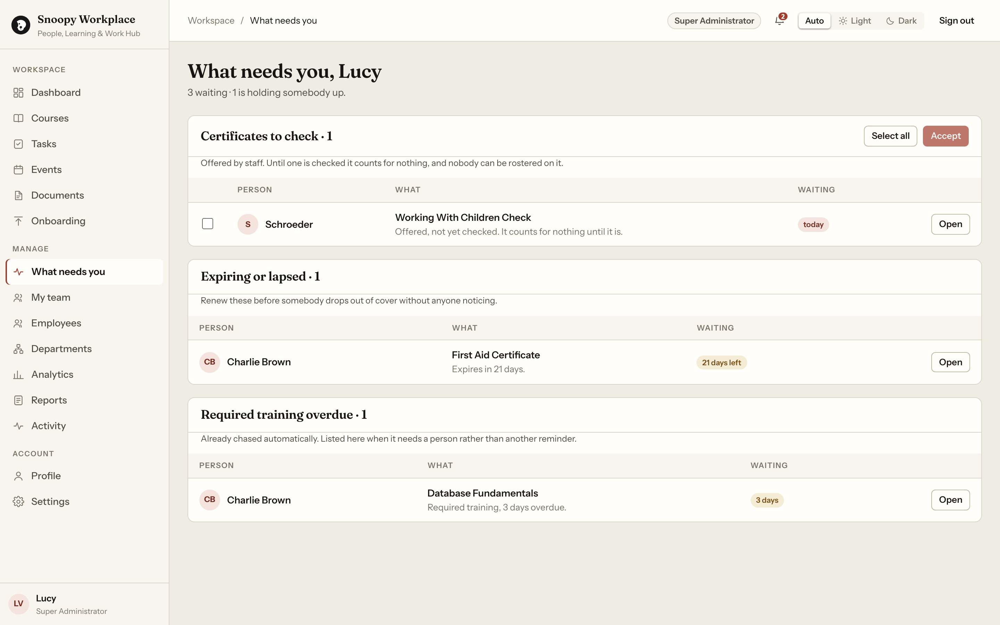

Signed in as a Super Administrator, the same account sees a personal dashboard on
the phone and the whole workspace on the desktop. That is the capability model,
not a layout accident.

| Phone, as an administrator | Desktop, same account |
|---|---|
| 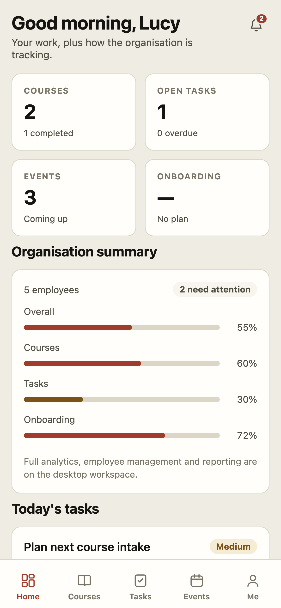 | 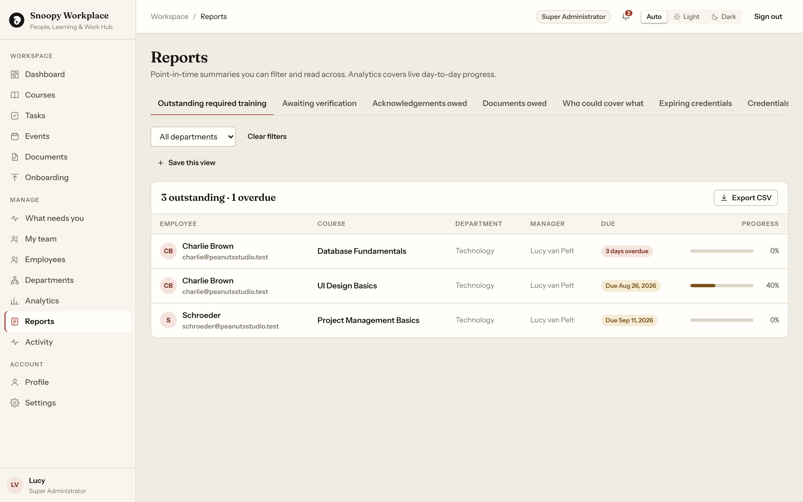 |

**The record, and what it owes.** Employment particulars sit on the record
because the law requires them; the statements below are computed from them
rather than remembered.

| Statements owed | Recent sign-ins |
|---|---|
| 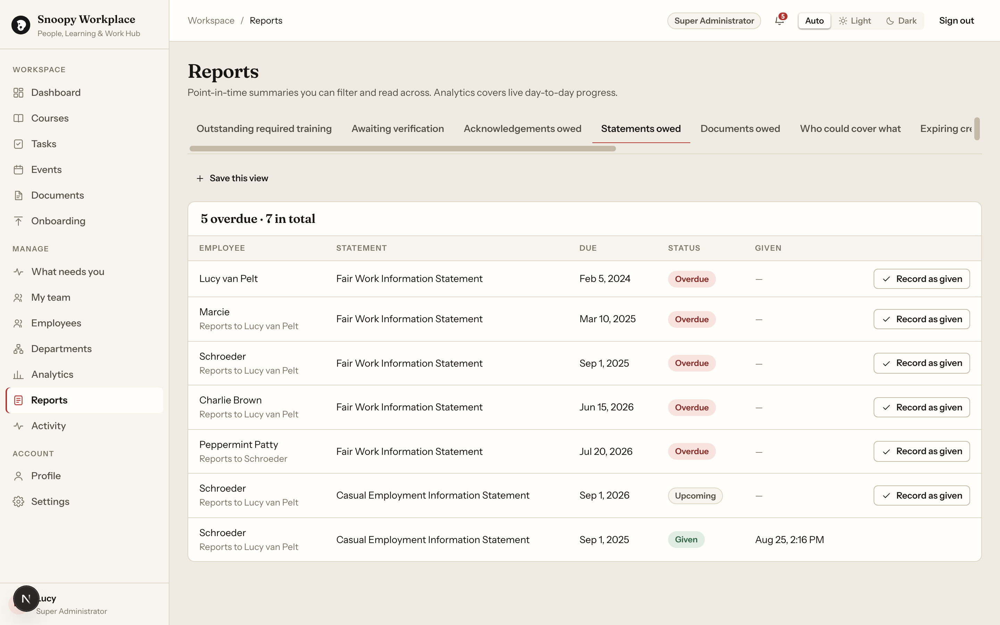 | 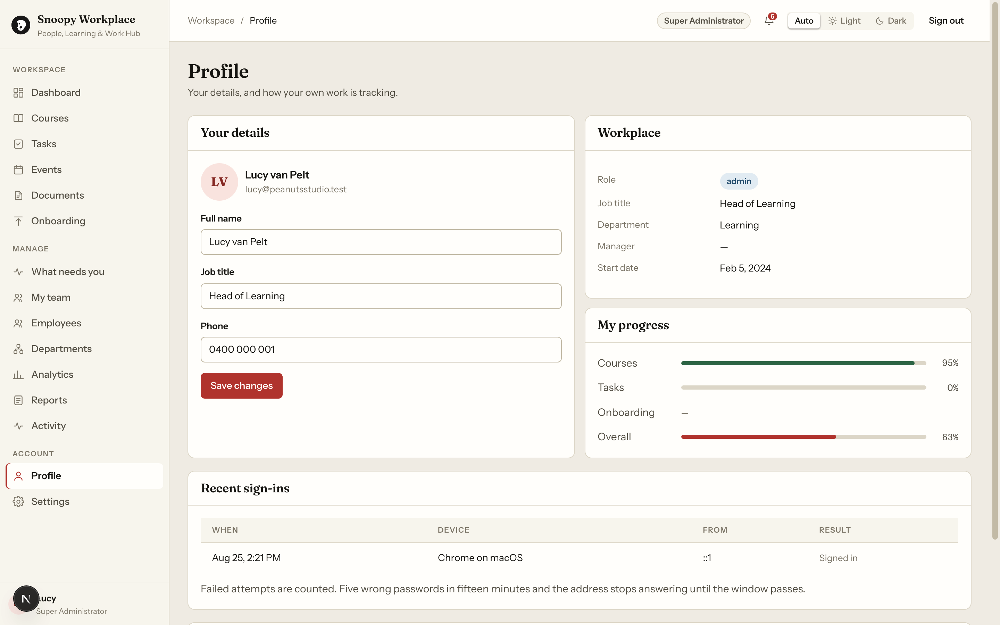 |

**Reading a file where it lives.** Preview renders the document in the
workspace rather than handing it to the browser — and records the read exactly
as a download would.

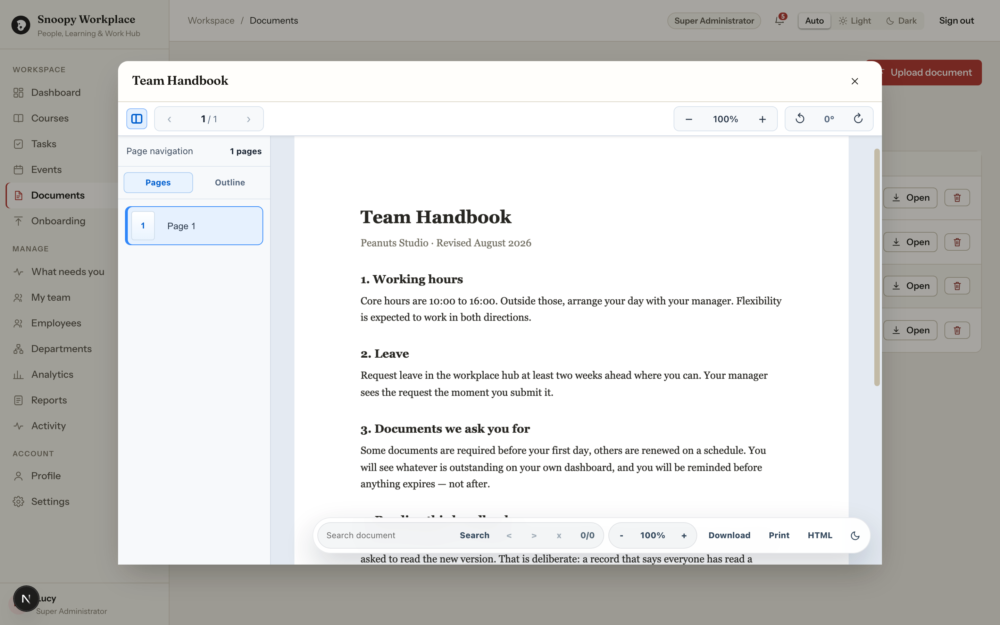

**Handing things in from the phone.** These three screens are the phone's real
job: discharge an obligation where you are standing, and leave the judging to
somebody at a desk.

| Requested from you | Add a certificate | Upload a document |
|---|---|---|
| 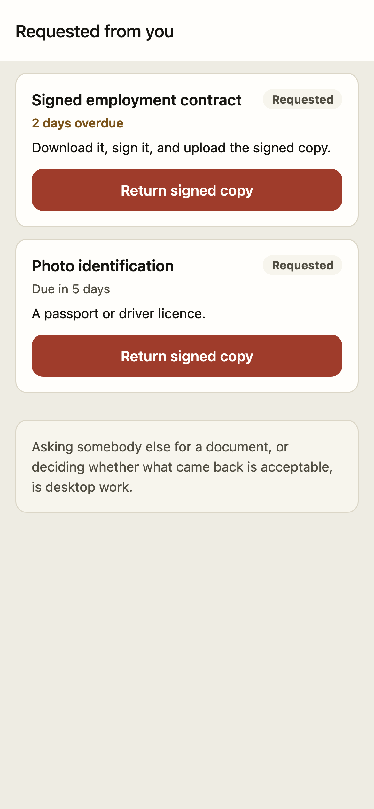 | 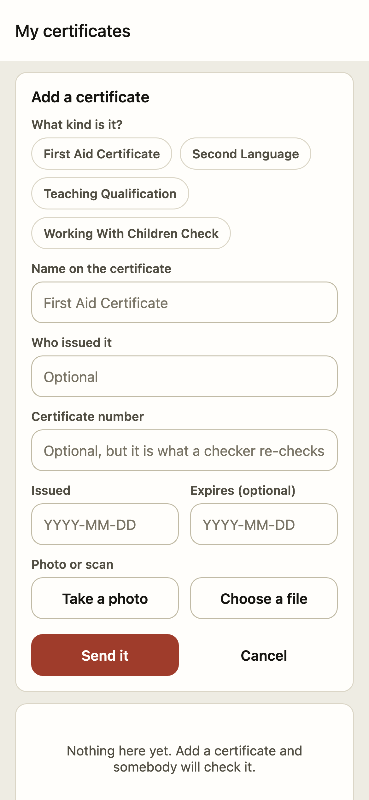 | 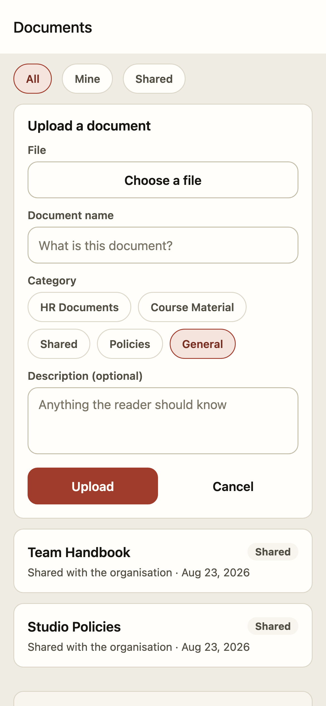 |

**Seeing, without approving.** A manager's team on the phone carries a currency
figure each and no action anywhere; every approval named in the footer lives on
the desktop.

| My certificates | My team | Profile shortcuts |
|---|---|---|
| 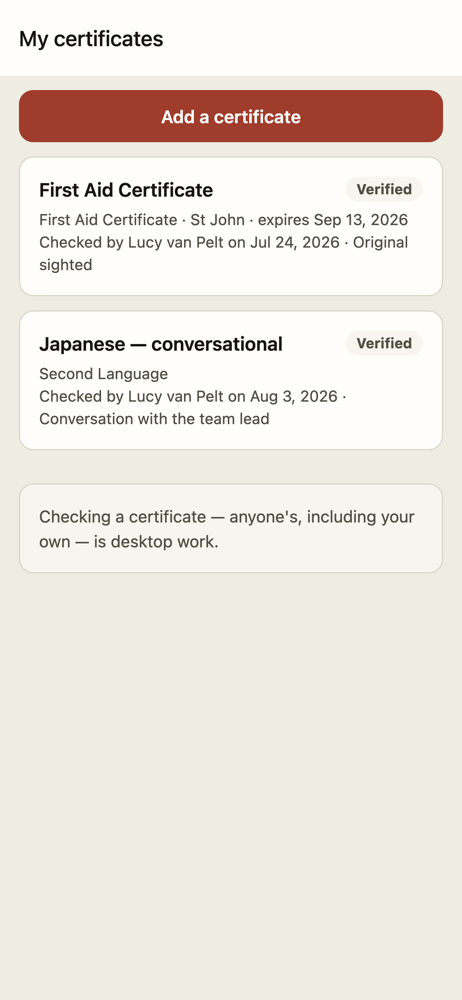 | 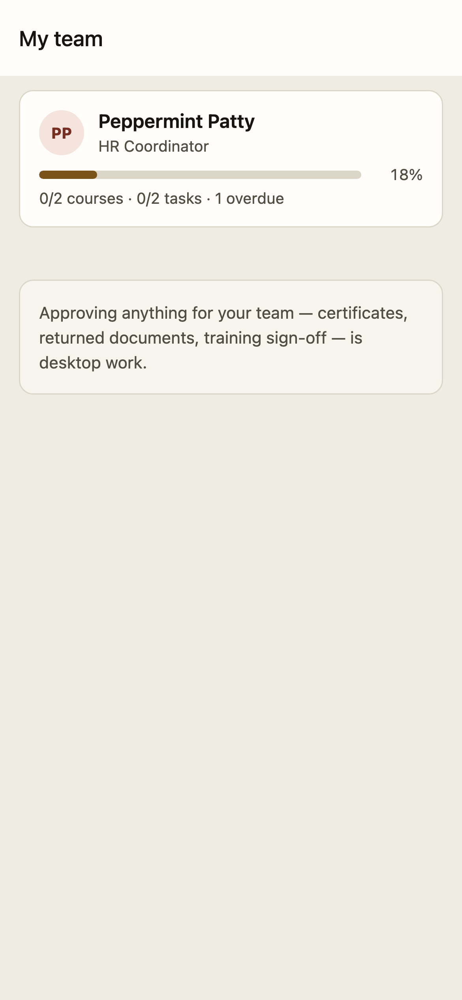 | 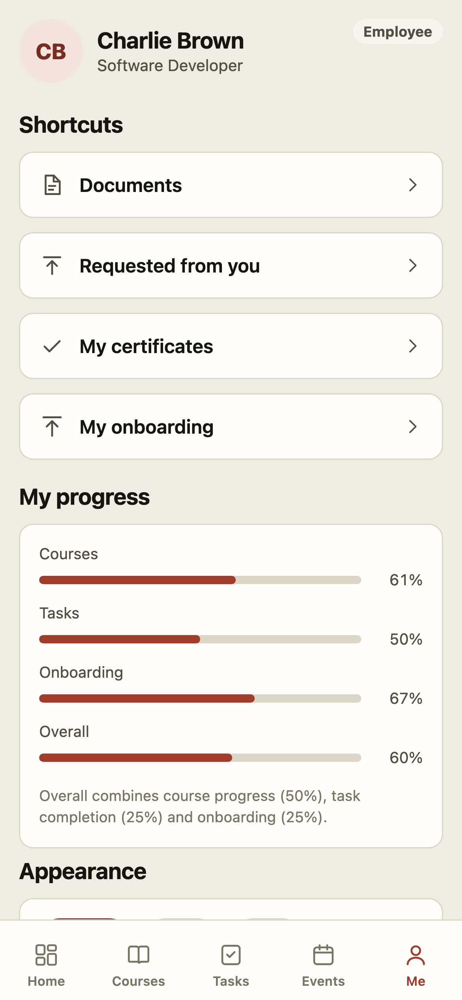 |

## Ownership model

The top-level entity is the **organisation**. Every organisation-owned record
carries `organisation_id`, and that column alone defines tenancy.

User columns describe a *relationship* to a record and are never treated as
tenancy:

| Column | Means |
|---|---|
| `owner_id` | the user who owns this record (a personal document) |
| `assigned_to` | who is responsible for doing it |
| `created_by` | who created it |
| `uploaded_by` | who uploaded the file |
| `completed_by` | who actually completed it |
| `actor_id` | who performed a logged action |

So a course belongs to the organisation, not to its teacher; personal course
progress lives on `course_assignments`, not on `courses`; a document with
`owner_id = null` is shared with the organisation, and one with an `owner_id`
belongs to that person.

### Tables

`organisations`, `departments`, `profiles`, `roles`, `courses`,
`course_assignments`, `tasks`, `events`, `event_participants`, `documents`,
`onboarding_templates`, `onboarding_template_steps`, `employee_onboarding`,
`onboarding_steps`, `activity_log`.

---

## Row Level Security

RLS is enabled **and forced** on every table; nothing is disabled for
convenience. Two `security definer` helpers resolve the caller without
recursing through the profiles policies:

- `current_org_id()` — the organisation on the caller's profile
- `is_admin()` — whether the caller holds the admin tier

The policies enforce:

- **Organisation isolation** — every read and write is scoped to `current_org_id()`.
  An admin of one organisation gains nothing in another.
- **User ownership** — employees read their own assignments, tasks, documents
  and onboarding. They can update their own course progress and their own task
  status, and nothing belonging to a colleague.
- **Shared documents** — `owner_id is null` is readable organisation-wide;
  only admins can create or manage them.
- **Admin scope** — administrative writes require both the admin tier and a
  matching organisation.

Storage policies check the organisation folder in the object path against the
caller's own profile, so a client-supplied path cannot reach another tenant.

Client-side capability checks are UX. **RLS is the security boundary.**

---

## Australian employment record obligations

This is an HR workspace, so the record it produces has to stand up. Three
obligations under Australian law shaped what the app stores, what it refuses to
delete, and what it works out on its own. Each one is enforced in the database
rather than in a form, because a rule that lives in a form is a rule until
somebody uses `curl`.

> Not legal advice, and not a compliance product. It is the record-keeping an
> HR workspace has to get right before anything else it does is worth anything.

### What kind of employment it is

The **Fair Work Regulations 2009 (reg 3.32)** require an employer to record,
for every employee, whether the employment is full-time or part-time, and
whether it is permanent, temporary or casual. This workspace held a job title
and a start date and neither of those two facts, so the record it produced
could not be a complete one.

They are columns, not free text, because the rest of the app has to reason
about them — who is casual decides who is owed a Casual Employment Information
Statement, and when. The database refuses the contradiction (casual on one
count and not the other) rather than storing it for somebody to resolve later
from memory, and the self-service guard pins both: an employee editing their
own profile cannot move themselves off casual, which would change what the
employer owes them.

`end_date` is on the record for the same reason — *when did they leave* is
itself a required particular, and inferring it from a deactivated account is
not a record.

### Seven years, and not a day less

**Reg 3.31** requires employee records to be kept for seven years from the day
each record is made — not from the day the person leaves. The app was
hard-deleting personal documents from storage on request, which is the opposite
obligation.

Every document now carries `retain_until`, and a `BEFORE DELETE` trigger
refuses to destroy a personal one inside it, with the date in the message. Three
deliberate edges:

- **A shared document is not an employment record.** The handbook is published
  to the workspace, not evidence about anybody, so it stays deletable.
- **The day it was filed is left open.** A document put on the wrong person can
  be taken back off — a record describing the wrong employee is a *false*
  record, which reg 3.44 prohibits separately. After that day it stands.
- **The period can be extended but never shortened.** A retention date that can
  be set to yesterday is not a retention period at all; the delete guard would
  wave the record straight through. A record held for a dispute is kept longer,
  never less, so the later of the two dates wins.

The desktop replaces the delete button with *"Record — kept until 12 Aug 2033"*
rather than offering a control that fails.

### The statements that fall due again

Two obligations no amount of good intent covers, because both are about
*timing*:

| | Obligation | When |
|---|---|---|
| **s.125** | Fair Work Information Statement | Every new employee, before starting or as soon as practicable after |
| **s.125B** | Casual Employment Information Statement | Every casual, on the same terms — **and again** at set points afterwards |

The second is what gets missed. It is not an event anybody witnesses; it is a
date that passes. A **small business employer** (fewer than 15 employees) owes
it again at 12 months; every other employer owes it at 6 months, at 12 months,
and every 12 months after that for as long as the employment stays casual.

So it is **computed, not remembered**. The `statement_obligations` view derives
every falling-due from the employee's own start date and the size of the
workspace, and left-joins what was actually handed over. Nothing is scheduled
and nothing drifts: somebody who turns casual this morning grows the right
history immediately, and an anniversary that has not arrived yet still shows,
so a statement can be given before it is late rather than after.


Recording that one was handed over stores the date it was **owed**, not the
date it was given, so settling a March obligation in August still reads as
March. The row cannot be edited or removed afterwards — there is no update or
delete policy on the table — because *"we gave it to her in March"* is only
worth anything if it cannot be typed in later. An employee sees what they were
given and cannot record it themselves; it is a record of what the employer did.

Headcount is counted on the head, not the hours. s.23 counts casuals towards
the small-business threshold only when they are employed on a regular and
systematic basis, which this workspace does not model — so it counts them all
and errs towards owing the statement more often rather than less.


### Contractors, and who is actually an employee

The employment particulars offered ongoing, fixed term or casual, so anybody
engaged on a contract was being filed as one of the three things they are not.
That is not cosmetic. Most of what this app tracks is owed to **employees** —
the Fair Work Information Statement, the casual statement, the employee choice
pathway — so recording a contractor as an employee makes the workspace owe them
things it does not, and report gaps that are not gaps.

`Contract` is now a fourth basis, and the consequences follow it automatically:

- A contractor is owed **neither** information statement. The register excludes
  them rather than listing them as overdue.
- A contractor cannot use the casual conversion pathway, which is for casuals.
- A contractor is **not counted** towards the small business threshold, because
  they are not an employee.

The two halves still have to agree — casual on one count and something else on
the other is refused by the database, as before.

### Are we a small business employer?

The threshold decides real things: whether a casual waits **six months or
twelve** before they may ask to go permanent, and which schedule their
statement runs on. It was being answered by counting rows in `profiles`, which
is the rough shape of s.23 and wrong in three specific ways.

Section 23 counts employees of the employer **and of any associated entities**,
and counts casuals **only** where they are employed on a regular and systematic
basis. Neither is derivable from this database: associated entities are not in
it, and whether a casual's pattern is regular and systematic is a judgement
about rosters. So both are asked, in **Settings**.

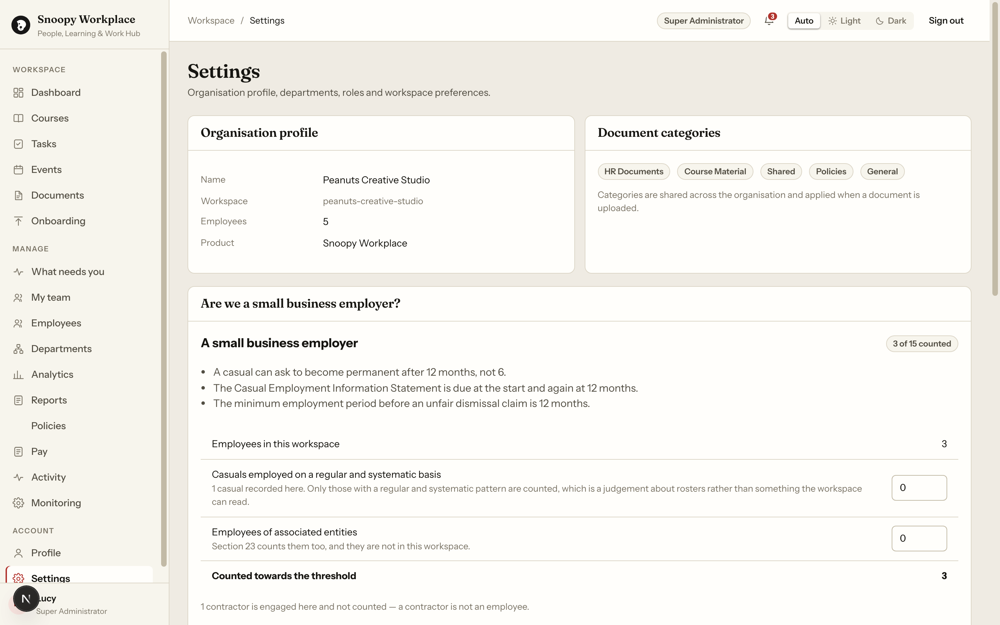

Three questions, and the arithmetic is shown rather than the conclusion alone:

| Counted | From |
|---|---|
| Employees in this workspace | The records, excluding casuals and contractors |
| Casuals on a regular and systematic pattern | Asked — the roster knows, the database does not |
| Employees of associated entities | Asked — they are not in this workspace at all |

An employer who already knows where they stand can **say so**, with a reason,
and their answer is used in preference to the count — they are the one who has
to defend it, and they know about the entities and rosters this database has
never seen. Every answer records who gave it and when.

The consequences are listed on the screen next to the answer, because a
threshold with no stated consequence is trivia. And changing it changes what
the workspace owes people, not just a label: the checks flip the count past
fifteen and watch the casual statement schedule grow a six-month due date, then
flip it back and watch that date disappear.

### Casuals asking to become permanent

Since the Closing Loopholes changes a casual does not wait to be offered
permanent work — they notify the employer in writing, and the employer has to
answer. Three parts of that are deadlines rather than intentions, which is why
they are in the database rather than in somebody's diary:

| | Rule |
|---|---|
| **Who may ask** | A casual with six months' service — **twelve** in a small business employer — and not again within six months of their last notice |
| **What the employer must do** | **Consult** the employee, then answer **in writing within 21 days** |
| **When it may be refused** | Only on one of **three** grounds, and the answer has to say which |

Eligibility is computed from the record, not asserted: an employee cannot give
a notice they are not entitled to, and HR cannot wave one through that they
are. The reason is always shown with a date — *"a notice was already given on
31 Jul 2026. Another can be given from 31 Jan 2027."* — because "not yet"
without a date is the same as "no".

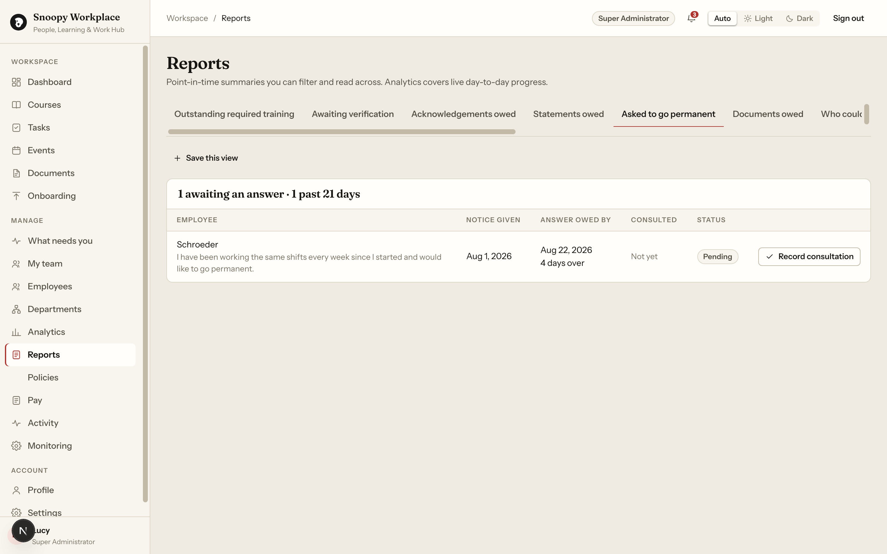

Consultation is its own step because it is its own obligation: an answer
written without one is a defective answer, and the database refuses to accept a
decision until the consultation is recorded. The three refusal grounds are an
enum, not a text box — *why was this refused* is the question the Fair Work
Commission asks, and free text answers it differently every time.

Accepting updates the employment particulars **in the same transaction as the
answer**, so the record and the decision cannot disagree. That has a
consequence worth watching in the checks: the moment somebody stops being
casual, they stop being owed the Casual Employment Information Statement, and
the statement register agrees without anybody touching it.

### The policies an employer must have in writing

Several obligations are not satisfied by intent or by conduct. The positive
duty under the Sex Discrimination Act is the clearest — taking *"reasonable and
proportionate measures"* is assessed on what you can show, and a policy nobody
has read is not a measure.

Nothing new was invented for this. The workspace already had documents, with
versions, and read receipts recorded against the version in force. What was
missing was the other direction: a list of what **ought** to exist, so a policy
that was never written shows as a gap rather than as an absence of a row.

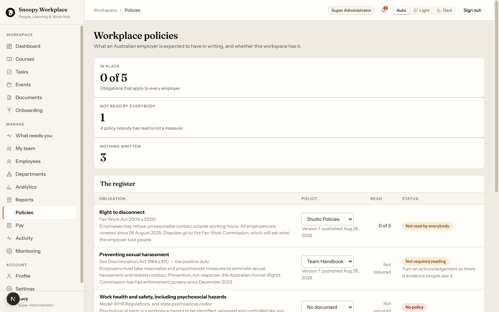

Seven obligations, each with the authority it comes from, and four states:

| State | Means |
|---|---|
| **No policy** | Nothing claims this obligation |
| **Not required reading** | A document claims it, but nobody has to acknowledge it — so there is no evidence anyone saw it |
| **Not read by everybody** | It must be read, and some people have not |
| **In place** | Current, and acknowledged by everyone |

Two of the seven are marked as **not universal** — whistleblower protections
depend on company structure, workplace surveillance on state law and on whether
the workplace does any. Reporting those as gaps for an employer they do not
apply to is how a register teaches people to ignore it.

The register is **derived, not maintained**, which is the only kind that stays
true for longer than a month. One consequence is load-bearing and is tested:
re-issuing a policy bumps its version, which retires every receipt against the
old one — so a rewritten policy drops from *In place* back to *Not read by
everybody* rather than staying green on last version's receipts.

### When something goes wrong: the breach register

The workspace could already answer *what happened* — who signed in from where,
who opened whose file, what changed. The Notifiable Data Breaches scheme asks
something the audit trail cannot: **what did you do about it, and how quickly.**

The obligation is a clock with two ends. Suspecting an eligible breach starts a
**reasonable and expeditious assessment, thirty days at the outside** — the
outer limit, not the target. An assessment finding reasonable grounds to
believe the breach is eligible obliges notification of the OAIC **and** of the
people affected, as soon as practicable; there is no second thirty days for
that half.

So the register holds the dates rather than the prose: suspected on, assessment
owed by, assessed on, what was decided, notified on. It sits as a fourth tab on
**Monitoring**, because a breach is what somebody opens that page for.

- **The clock runs from the suspicion, not from the typing.** The date is
  backdatable on entry and immovable afterwards — neither the suspicion date
  nor the deadline can be edited once recorded.
- **A finding cannot be recorded without its reasoning.** Write it as if it
  will be read by somebody who disagrees, because that is when it is read.
- **A notification cannot be logged before there is a finding**, and telling
  the Commissioner does not discharge telling the people. They are separate
  obligations landing at separate moments, so they are tracked separately.
- **Nothing can be deleted.** A breach that turned out to be nothing is
  recorded as nothing — *"we looked and decided it was fine"* is the most
  important row in the register when somebody later disagrees.

**Sources.** [FWO — Becoming a permanent employee](https://www.fairwork.gov.au/starting-employment/types-of-employees/casual-employees/becoming-a-permanent-employee) ·
[FWO — Casual conversion changes](https://www.fairwork.gov.au/about-us/workplace-laws/legislation-changes/closing-loopholes/casual-employment-changes/casual-conversion) ·
[AHRC — the positive duty](https://fairworkmate.com.au/blog/employer-positive-duty-sexual-harassment-respect-at-work) ·
[Safe Work Australia — sexual and gender-based harassment WHS duties](https://www.safeworkaustralia.gov.au/safety-topic/hazards/sexual-and-gender-based-harassment/whs-duties) ·
[OAIC — Notifiable Data Breaches scheme](https://www.oaic.gov.au/privacy/notifiable-data-breaches/about-the-notifiable-data-breaches-scheme)


### Pay records and pay slips

This was the largest gap. Fair Work Regulations 3.33–3.36 require records of
what somebody was paid, the hours behind it and the superannuation contributed;
**reg 3.46** requires a **pay slip within one working day of the payment**,
whether or not the person is on leave. None of it existed here, and the
seven-year retention this app enforces on documents was quietly not covering
the records most often asked for.

**What this is not is a payroll calculator, and that is a decision rather than
an unfinished edge.** Nothing here works out PAYG withholding or the
superannuation guarantee. Those belong to a payroll engine with a maintained
Australian regulation behind it — getting them wrong costs somebody real money,
and a schema written alongside an onboarding tracker has no business having an
opinion about tax scales.

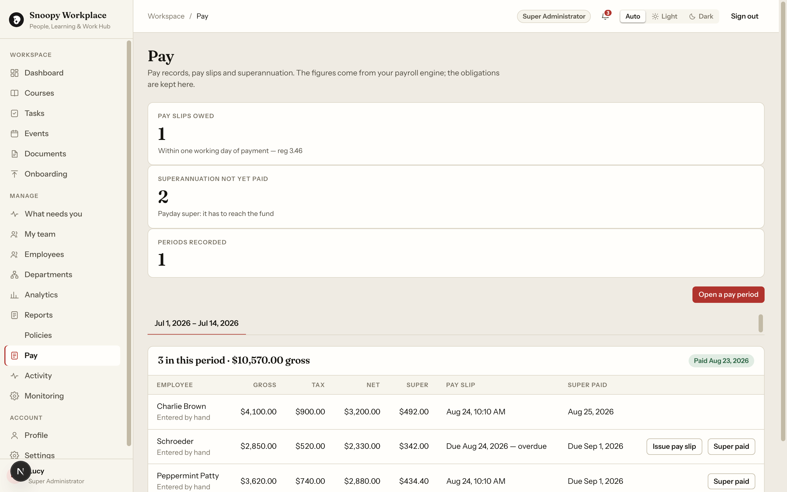

So the figures arrive from outside, and what happens here is the part the law
puts on the employer regardless of who did the arithmetic:

- **A period is a draft until it is paid.** Both deadlines — the pay slip and
  the superannuation — count from the day the money moved, so recording that
  day is a distinct act rather than a side effect of the last line being typed.
- **A paid period is closed.** Its figures cannot be edited and it cannot be
  reopened or take new lines; a correction is an adjustment in a later period,
  which is how payroll has always handled it. Nothing can be deleted at all.
- **Net above gross is refused** — not an accounting rule so much as a typo
  detector, since the two are entered separately and transposing them is the
  common mistake.
- **Pay is the most sensitive thing in the workspace**, so the read rule is the
  narrowest in the app: your own and nothing else. **A line manager gets no
  special view** — what somebody earns is not line-management information.
- **`source` stays on the record** — entered by hand, or returned by an engine,
  with the engine's own reference. *Where did this number come from* is the
  first question asked when one of them is wrong.

Two Australian deadlines are approximated rather than exact, and the
approximation errs early: working days are counted as weekdays because this app
holds no public holiday calendar, and holidays differ by state. The deadline it
reports is the earliest that could apply, not the latest.


### The documents are real

Every document used to be a row naming a storage path with nothing behind it.
That is invisible until somebody clicks Preview, and then the whole half of the
app reads as a mock-up: the access log records reads of nothing, the seven-year
retention protects nothing, and a pay slip is a timestamp rather than something
an employee can hand to a bank.

Every document now has an actual PDF behind it, built with `pdf-lib`:

- **Employment agreements** carry that person's own particulars — position,
  commencement, hours, basis — and say different things for a casual, a
  contractor and an ongoing employee, because the terms differ.
- **Each of the seven policies** in the register is the policy: right to
  disconnect under s.333M, the positive duty under s.47C, psychosocial hazards,
  discrimination, privacy, whistleblower, surveillance.
- **Handbooks, course material and anything else** get a real document saying
  what they are.
- **Pay slips are generated when issued** and filed as the employee's own
  personal document, so they inherit everything that already applies to those:
  the employee can read it, the access log records anybody else who does, and
  retention keeps it.

[`scripts/seed-files.mjs`](scripts/seed-files.mjs) writes a file behind any
document that lacks one, working out what it should say from what the row
already knows. It runs from `npm run db:reset` and inside `npm run check`, and
skips anything that already has a file.

**This found a real hole.** Storage read access was checked against the
*organisation* folder alone, so any signed-in colleague could fetch any object
in their workspace — including somebody else's employment agreement. Row level
security hid the row, so the app never offered the path, but a path is
guessable and hiding a row is not protecting a file. Nothing exploited it while
every object was a placeholder, which is exactly why it survived: there was
nothing behind the paths to find. The storage policy now mirrors the row policy
clause for clause — `shared/` to the workspace, `{owner}/` to that person,
their manager, or an administrator.

### Issuing pay slips

Two things were wrong with issuing them one at a time.

**It looked like it did all of them.** Issuing one slip on a page where others
were already issued is indistinguishable from issuing every slip, and *"Saved."*
did nothing to tell them apart. The confirmation now names the person: *"Pay
slip issued to Schroeder."*

**A pay run ends with one decision and thirty slips.** Asking somebody to click
thirty times is how the thirtieth gets missed, and reg 3.46 has no "we did most
of them" exception. **Issue N pay slips** does the outstanding ones for a period
in one go, generating every document.

### An employee's own pay

`/payroll` serves two views from one route: whoever runs the pay sees the pay
run, everybody else sees **their own history in full** — every period, not the
last few. A pay slip is something people go looking for at tax time or when a
bank asks, and a list that stops at four fails exactly then. Totals for gross,
tax and superannuation across every recorded period sit at the top, and each
row links to the PDF in their documents.

Splitting this into two addresses would have meant an employee following a link
to `/payroll` and being told they may not see their own pay slips.

### Where a payroll engine plugs in

[Payroll Engine](https://payrollengine.org/) is the intended calculation layer —
MIT-licensed, regulation-as-code, REST-first. The seam is
[`PayrollEngine`](packages/shared/src/services/payroll.ts): `available()` and
`calculate()`, and nothing else. Keeping the surface that narrow means this app
never grows an opinion about tax and the engine can be swapped without touching
anything above the line.

It is **typed and wired, not running**, and two facts decide that — both
measured rather than assumed:

- **The engine ships no Australian regulation.** It is a framework for
  executing regulations somebody authors. PAYG withholding scales, the
  superannuation guarantee and STP Phase 2 would all have to be written and
  maintained as regulation before any figure it returns is fit to pay a person.
  Pointed at an empty engine, it produces confident zeroes.
- **Its backend is published for amd64 only** (`docker manifest inspect` on
  `ghcr.io/payroll-engine/payrollengine.backend`) and requires SQL Server 2019,
  which is also amd64-only. This machine is aarch64 with 2 CPUs and ~2 GB of
  Docker memory, already running eight Supabase containers.

Until `PAYROLL_ENGINE_URL` and `PAYROLL_ENGINE_TENANT` are set **and** the
engine carries a regulation, `available()` is false and the app records figures
entered by hand — which is a real way to run small payroll, and an honest one.

**Still not covered:** leave balances and accruals (reg 3.36's other half), and
STP reporting to the ATO.

### What this still does not do

- **No pay calculation.** Records and deadlines are kept; PAYG withholding and
  the superannuation guarantee are not computed. See above.
- **No leave balances**, so nothing about accruals or cash-out records.
- **No Single Touch Payroll reporting.** STP Phase 2 goes to the ATO from the
  payroll system, and this is not one.
- **No WGEA reporting.** The gender pay gap calculation needs remuneration data
  this app deliberately does not hold; headcount composition alone would not be
  a submission.
- **The policy register checks that a policy exists and was read, not that it
  is any good.** Whether a right-to-disconnect policy is *adequate* is a
  judgement no schema makes.

### On the Privacy Act

- **The employee records exemption is not leaned on.** Private
  sector employee records are currently exempt from the Australian Privacy
  Principles, and the government has agreed in principle to narrow that. The
  app is built as if it were not exempt: personal documents are visible to
  their subject, reads of them are logged and shown to the subject, emergency
  contacts are readable only by the person and HR, and nothing is retained
  beyond the period that requires it.

**Sources.** [Fair Work Ombudsman — Record-keeping](https://www.fairwork.gov.au/pay-and-wages/paying-wages/record-keeping) ·
[Fair Work Act 2009 s.535](https://classic.austlii.edu.au/au/legis/cth/consol_act/fwa2009114/s535.html) ·
[Fair Work Information Statement](https://www.fairwork.gov.au/employment-conditions/information-statements/fair-work-information-statement) ·
[Casual Employment Information Statement](https://www.fairwork.gov.au/employment-conditions/information-statements/casual-employment-information-statement) ·
[OAIC — Employee records exemption](https://www.oaic.gov.au/privacy/privacy-guidance-for-organisations-and-government-agencies/organisations/employee-records-exemption)

---

## Zero Trust, and where it actually bites

Zero Trust is three claims — *verify explicitly, least privilege, assume
breach* — and the honest way to describe an app against them is to say which
were already true, which were not, and what the remaining gaps are.

### Verify explicitly

Nothing is trusted for where it came from. There is no "internal" side of this
app: the desktop workspace, the phone app, `curl`, and a stolen session all
arrive at the same database and are asked the same question.

- **Every request re-proves the caller.** The session cookie is refreshed in
  middleware, but the middleware is only a redirect for people who are
  obviously signed out — it reads the cookie without a round trip because it
  runs on every request including prefetches. The authoritative check is
  `requireSession`/`requireCapability` per route, which verifies with the auth
  service, and then RLS, which re-derives the caller from the JWT on every
  single statement. A forged cookie gets past the redirect and fails twice.
- **One door in.** Sign in used to happen in the browser, straight against the
  auth service. That works and leaves nowhere to stand: the app never learns a
  password was guessed wrong. [`/api/auth/sign-in`](apps/desktop/src/app/api/auth/sign-in/route.ts)
  now fronts it — same session cookies, one extra hop, and three things that
  were impossible before.
- **The refusal says nothing.** Wrong password and unknown address return the
  same sentence. Telling them apart enumerates who works here.
- **A tampered token is refused, not ignored.** Verified in the checks by
  mutating the last four characters of a real JWT: `401`, not an empty result.

### Least privilege

- **Permissions are enforced where the data is**, not in the components. 58
  capabilities decide what the UI offers; RLS policies and `has_permission()`
  decide what the database will do. The client-side check is UX.
- **Editing somebody and granting them access are different permissions.**
  `updateEmployeeAction` used to take a free-form patch, so changing a job
  title and handing out administrative access were one call. Role assignment
  is now stripped out with the other identity fields and put back only for a
  caller holding `user.role_management`.
- **Server Actions are HTTP endpoints, and are treated as such.** Several take
  a patch object and hand it to an update; that object comes from the network,
  not from the form. [`safePatch()`](apps/desktop/src/lib/actions.ts) strips the
  fields that say *who a row belongs to* and *where it came from* —
  `organisation_id`, `owner_id`, `user_id`, `created_by`, `version`,
  `retain_until` and the rest — before the request is made. RLS would catch
  most of it; this stops the app sending it in the first place. It is a
  denylist, which is the weaker shape: it covers every table at once, where a
  per-table allow-list would be stricter but has to stay right about columns
  nobody remembers to update.
- **Column guards, not just row guards.** RLS is row-level; it cannot say "you
  may update this row but not that column". Six `BEFORE UPDATE` triggers do
  that job — an employee editing their own profile cannot change their role,
  their manager, their start date or their employment basis; a retention date
  cannot be shortened; a read receipt cannot be pointed at a different version.

### Assume breach

- **The page is treated as a place code might run.** A
  [Content-Security-Policy](apps/desktop/next.config.mjs) plus `X-Frame-Options`,
  `nosniff`, `strict-origin-when-cross-origin`, a `Permissions-Policy` that
  denies camera, microphone and location, and HSTS in production. `frame-ancestors
  'none'` matters more here than it looks: this app is full of one-click approval
  buttons, which is exactly the shape clickjacking wants.
- **`unsafe-inline` is still there, and it is not decoration.** The theme is
  applied by an inline script before first paint so the page does not flash the
  wrong colour scheme, and Next inlines its own bootstrap. A nonce would remove
  it and would mean giving up static rendering on every route that has one.
- **Repeated guessing is cut off — below both apps, not inside one.** The first
  version of this counted failures in the web app's sign-in route, which meant
  it did not exist for the phone app, or for anything else holding the anon
  key. An attacker is not going to use our front door. It is now a
  [GoTrue password verification hook](supabase/migrations/20260825000300_sign_in_hook.sql):
  the auth service calls it on every password attempt before issuing a session,
  whichever client is asking, and there is no way in that skips it. Five
  failures in fifteen minutes and the account stops answering. The window rolls
  forward on its own; nothing is unlocked by hand.
- **Counted per account, not per address.** An attacker moves between addresses
  far more cheaply than a person changes accounts. An address nobody works
  under accumulates nothing at all — the hook only fires where there is a user
  to verify a password against, so there is no list of guessed addresses to
  read and no table to fill with garbage.
- **A stolen session is the failure this app cannot prevent, only make
  visible.** Every attempt is recorded and shown to the person it belongs to —
  when, which app, what device, what time zone, from where. Rows are written by
  the hook, not by any client; there is no insert, update or delete policy at
  all, so a session cannot forge a sign in that never happened or bury one that
  did.


### One history, both apps

The sign-in history is not per-app. `sign_in_events` is one table keyed by the
person, and both clients read every row belonging to the caller: sign in on the
phone and it is on the desktop list, and the other way round.

What the hook cannot see is the network — a database function called by the
auth service has no idea which address or which browser asked. So the two
halves of a row come from different places:

| Written by | What it knows |
|---|---|
| The auth hook | The attempt itself — who, when, whether the password was right |
| The web route | The address and the browser, filled in afterwards with the service key |
| The phone app | Which app it is, the device, and the clock — stamped through `describe_my_sign_in` |

The phone has no service key and should not have one, so it labels its own row
through a function that is deliberately narrow: **your own** most recent
attempt, **only** if nothing has described it yet, and **only** within a minute
of it happening. A described row cannot be relabelled. The worst a compromised
session can do with it is mislabel the sign in it just made, which it could
have done anyway by lying about its user agent.

A sign in with no label at all is shown as such rather than dressed up — that
is what an attempt from something that is neither app looks like, and it should
stand out.

**Time zone is reported by the device, never geolocated from the IP.** Two
reasons. Resolving an address to a place means sending your staff's addresses
to a third party to find out where they are, which is not a thing to do quietly
to your own people — and it would need a hole in the CSP to do it from the
page. It is also simply better evidence: the clock the person is actually
working to, rather than a guess from a network route.

### Session and activity monitoring

When somebody says *"I think we have had a breach"*, the hour that follows is
three questions — whose account, from where, and what was touched. A
Super Administrator can answer all three at **Monitoring**.

There was already an activity log, and it was **not** an audit trail, for two
reasons that are each fatal on their own:

- It was written by the *client* — application code remembering to call
  `logActivity` after doing something. Twelve actions were covered out of
  everything the app can do, and anything reaching the database another way
  wrote nothing at all.
- Its insert policy let any signed-in user add rows naming themselves as the
  actor. A record somebody can compose is a record, not evidence.

[`audit_log`](supabase/migrations/20260825000600_audit_trail.sql) replaces it.
Triggers on seventeen tables record every insert, update and delete with the
actor, the subject, and — for an update — **only the fields that actually
changed, before and after**. It does not depend on the app being well behaved:
a change made with `curl` is recorded identically, which the checks prove by
making one. An update that changed nothing is skipped, so the ones that matter
are not buried. There is no insert, update or delete policy, so nothing can be
added by hand, pinned on somebody else, or removed.

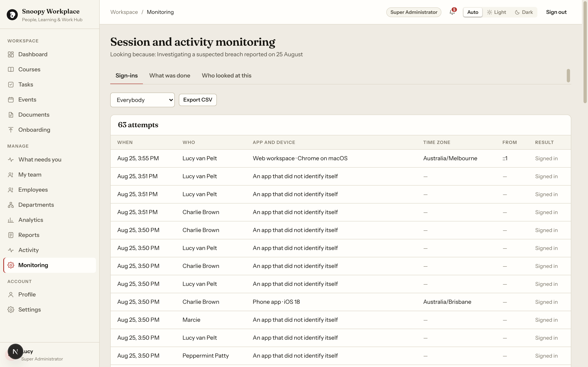

Three readerships, and the design is the argument:

| Who | Sees |
|---|---|
| **Super Administrator** | The whole workspace — the role that answers to the OAIC and to the people affected |
| **Everybody else, admins included** | What was done *to them*, and nothing about anybody else |
| **An admin who is not a Super Administrator** | Exactly what an employee sees. They are the population this exists to hold to account |

**Opening it requires saying why, and the saying is recorded** — on a third tab,
where the people being looked at can see it. So can any employee whose own
history was the subject. That is not ceremony: an investigative power nobody
can audit is indistinguishable from surveillance, and the people most able to
abuse this page are the only ones who can see it. Exporting is a look too, and
is recorded as one — a copy taken quietly would defeat the point of recording
the ones taken loudly.

Both views export to CSV, because a notification to the OAIC and to affected
individuals is a document, and the evidence behind it has to leave the app in a
form a lawyer or a regulator can read.

### What is *not* covered, stated plainly

- **No MFA.** The single largest remaining gap. Supabase supports TOTP
  enrolment; this app does not use it.
- **Tokens live in cookies the page's own JavaScript can read.** That is the
  `@supabase/ssr` design and the client components depend on it — uploading a
  document, acknowledging a policy and previewing a file all talk to Supabase
  from the browser. Marking the cookies `httpOnly` would sign those features
  out. The mitigation is the CSP above and the fact that a stolen token still
  reaches only what RLS allows that user.
- **The audit trail costs a trigger on every write** to seventeen tables. Fine
  at this size; it is the kind of thing to measure before a workspace with
  thousands of people, and the kind of table that needs a retention policy of
  its own eventually.
- **`client`, `device` and `time_zone` are self-reported.** They are labelled
  as hints in the schema and should be read as hints. The address is no better
  — it comes from a proxy header and is trivially spoofed. None of them grant
  anything; they exist so a person can recognise a sign in that was not them.
- **No device posture, no continuous risk scoring.** The nearest thing is real
  and load-bearing but narrower: capability is decided by role *and platform*,
  so an approval that must be recorded against somebody's name is refused on a
  phone regardless of who is asking.
- **Rate limiting is per instance for reads.** The sign-in limiter counts in
  the database and so survives a restart and works across instances; nothing
  else is throttled at the app layer.

---

## Roles and permissions

A role carries two things:

1. a **security tier** (`employee` or `admin`) — this is what RLS reads, via
   `profiles.role`; and
2. a **permission list** — capability keys that decide what the role reaches
   *inside* that tier.

Assigning a role writes `profiles.role_id`; a database trigger derives
`profiles.role` from the role's tier, so the enforced tier and the assigned role
can never disagree. The role editor also refuses to grant a capability the tier
could not exercise, because RLS would reject it anyway.

Every organisation starts with two system roles (Employee, Administrator).
Admins can create their own — the seed includes a *Learning Coordinator* role
that runs courses and onboarding but has no organisation settings.

Manage all of this at **Settings → Roles and permissions**: create roles, edit
permissions, change anyone's role inline, and invite new users by email.

---

## Platform capability strategy

Capabilities live in one place (`packages/shared/src/capabilities.ts`) and
resolve from **role × platform × granted permissions** to one of
`allowed`, `restricted`, `desktop_only`, `admin_only`.

| Feature | Mobile employee | Mobile admin | Desktop employee | Desktop admin |
|---|---|---|---|---|
| Dashboard | Full | Summary | Full | Full + analytics |
| Courses — view / update progress | ✓ | ✓ | ✓ | ✓ |
| Courses — create / edit / assign | — | — | — | ✓ |
| Tasks — view / complete | ✓ | ✓ | ✓ | ✓ |
| Task administration | — | — | — | ✓ |
| Events — view / RSVP | ✓ | ✓ | ✓ | ✓ |
| Events — create / edit / participants | — | — | — | ✓ |
| Documents — view / personal upload | ✓ | ✓ | ✓ | ✓ |
| Shared document management | — | — | — | ✓ |
| Onboarding — view / complete | ✓ | ✓ | ✓ | ✓ |
| Onboarding templates | — | — | — | ✓ |
| Employee management | Own profile | Summary | Own profile | ✓ |
| Roles, invitations, org settings | — | — | — | ✓ |
| Analytics / reports | Summary | Summary | Summary | Full |

Where a workflow exists but is desktop-only, mobile says so plainly rather than
hiding it: *"This workspace is optimised for desktop. Open Snoopy Workplace on a
larger screen to manage this feature."*

---

## Who opened my files

Personal documents include the ones people mind most: a passport scan attached
to a certificate, a signed contract, a medical note. Any HR user could open
them, and nothing recorded that they had — so *"who has looked at my file?"* had
no answer.

[`20260824000200_document_access_log.sql`](supabase/migrations/20260824000200_document_access_log.sql)
adds `document_access_log`, written by a `SECURITY DEFINER` function and by
nothing else: no insert, update or delete policy exists, because a log somebody
can edit is not a log. Reads are routed through one chokepoint —
`documentService.getDownloadUrl()`, which both clients already used — so signing
a URL in the browser still records the opening.

The database decides what is worth recording:

- **Opening somebody else's personal document** — logged, with who, whose, what
  and when.
- **Opening your own file** — not logged. Nobody else's business, and a log full
  of self-reads is a log nobody reads.
- **Opening a shared document** — not logged. The handbook is published *to*
  everybody; recording who read it is surveillance, not a control.


The subject sees the list on their own profile, and it appears in their History
on the desktop record. A line manager does not: knowing who read your contract
is not line-management information.

## Reading a document without leaving

"Open" hands the file to the browser: a new tab, a download folder, a copy of a
contract sitting in `~/Downloads` on a shared machine. For a quick look — *is
this the signed version? is the date right?* — that is the wrong trade. **Preview**
renders the file in place instead.

The renderer is [flyfish-dev/file-viewer](https://github.com/flyfish-dev/file-viewer)
(Apache-2.0), which previews PDF, Office, images, Markdown, archives and about
thirty other families **in the browser** — no conversion service, no third-party
upload, nothing leaving the machine that was not already leaving it. That
matters more here than the format list: the alternative to a browser-native
viewer is posting people's contracts to somebody else's server.


Three things it is wired into rather than bolted beside:

- **The same chokepoint.** Preview calls `documentService.getDownloadUrl()`, so
  looking at a personal document on screen writes the same audit row as
  downloading it. Reading is reading. The link is signed for five minutes
  rather than the usual sixty seconds, because the viewer fetches large files
  in ranges and a link that expires mid-read fails halfway through.
- **The stored file name, not the display name.** The viewer picks its renderer
  from the extension; "Employment Agreement" has none.
- **The workspace's theme.** An explicit Light or Dark choice is passed through,
  so the viewer's own toolbar does not arrive in the opposite colour scheme.

The runtime is ~179 MB of workers, WASM and fonts, so it is **not** committed —
`npm install` regenerates it into `apps/desktop/public/file-viewer/` via
`npm run assets:viewer`, and only the pipeline a given file needs is fetched at
runtime. Two build notes, both in
[`next.config.mjs`](apps/desktop/next.config.mjs): Node built-ins are stubbed
out of the browser bundle (isomorphic helpers branch on `process.versions.node`
and webpack resolves the branch a browser never takes), and pdf.js — itself a
webpack bundle — has its inner `__webpack_require__` renamed by a
[four-line loader](apps/desktop/scripts/rename-bundled-webpack-globals.cjs),
without which the nested names shadow the outer runtime and the module dies on
its first line. Production hid that one, because minification renames those
names as a side effect; development did not.

Mobile keeps handing files to the system viewer — the package targets the web,
and iOS and Android already preview a PDF better than anything shipped inside
the app would.

---

## What needs you, on a phone

HR's half of the phone app is one screen, and it is a **read**.

The question HR asks away from a desk is not "let me approve this" — it is *"is
anything blocking somebody today?"*. Answering it used to require a laptop, which
means it went unanswered until somebody was back at one.

**[`apps/mobile/app/overview.tsx`](apps/mobile/app/overview.tsx)** runs the same
`loadWorklist()` the desktop queue runs, and shows:

- **Blocking now** and **waiting in total**, plus headcount, overall figure and
  overdue tasks across the workplace.
- A count per source — certificates to check, documents returned, expiring or
  lapsed, completions to confirm, required training overdue, acknowledgements
  outstanding.
- The blocking items themselves: who, what, why it is stuck, and how long it has
  been waiting.

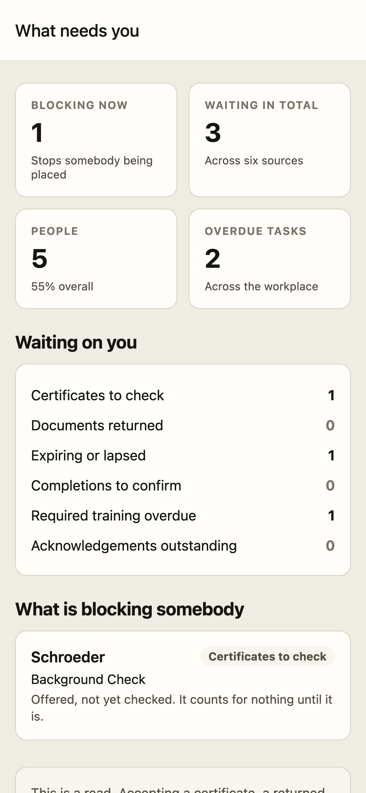

The home tab carries the same thing in one line, so the glance costs no taps:

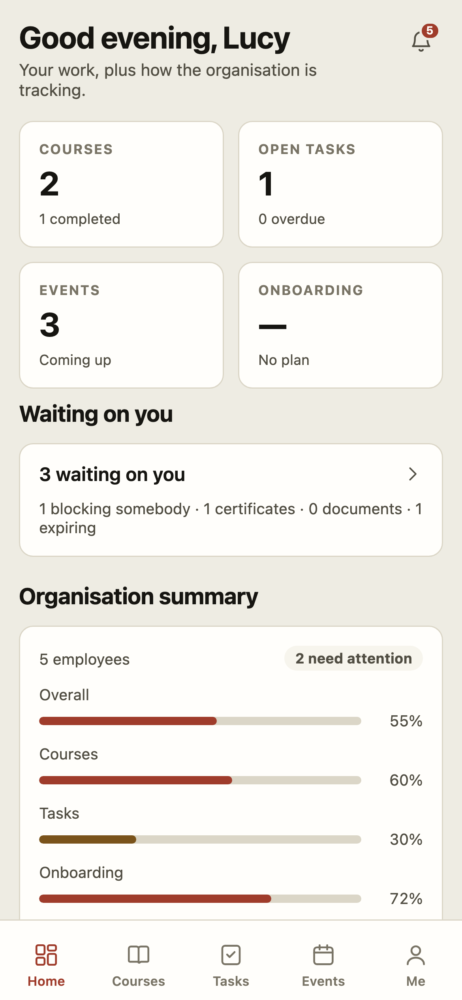

**Nothing on either screen is actionable.** No accept, no reject, no assign — the
footer says why: *"This is a read. Accepting a certificate, a returned document
or a completion is done on the desktop, where it is recorded against your name."*
Reading is not deciding, and an approval carries a name, a timestamp and a
recorded method, which is a deliberate act rather than something done one-handed
on a train.

The screen is gated on `analytics.view_summary` — admin, both platforms — which
was already phone-enabled and, until now, unused on the phone. The queue itself
is scoped by the caller's own session, so a manager sees their team and HR sees
the workspace without either of them choosing a filter.

## Returning what was asked of you

`document.submit` was phone-enabled from the beginning and had nowhere to happen,
so the phone could see a request and not answer it. It can now.

**[`apps/mobile/app/requests.tsx`](apps/mobile/app/requests.tsx)** lists what is
owed, outstanding first and settled last, each row carrying the instructions, the
due date, the template to download and the button to return the signed copy. A
request that was sent back shows the reviewer's reason above the button, because
"send it again" without saying what was wrong guarantees the same file comes back
twice.


Reviewing is not on this screen, and the footer says so rather than leaving a
gap: *"Asking somebody else for a document, or deciding whether what came back is
acceptable, is desktop work."* Accepting or returning a document is
`document.request` / `document.review_team`, both desktop-only.

## Offering a certificate from the phone

A certificate is a physical thing in somebody's hand, which makes photographing
it the one job the phone is unarguably better at.

**[`apps/mobile/app/credentials.tsx`](apps/mobile/app/credentials.tsx)** carries
a form rather than a bare file picker, because a scan with no issuer, number or
expiry cannot be re-checked by anybody later:

- **Type** — chips drawn from `credential_types`, and the type's own
  `verification_guidance` appears under the chips as soon as one is chosen.
- **Name, issuer, certificate number** — the number is what a checker re-checks.
- **Issued / expires** — validated as `YYYY-MM-DD`, and the expiry is *required*
  when the chosen type has `requires_expiry`.
- **Photo or scan** — **Take a photo** (`expo-image-picker`, camera permission
  asked at the moment of use) or **Choose a file**.


Nothing on this screen sets a status. A submission arrives `Pending` and stays
there until somebody holding `credential.verify` decides otherwise on the
desktop — and the record then shows who decided, when, and how they checked it:


## Uploading a document, with its details

The phone's upload used to fire the file picker straight into storage, filing
everything as an untitled file in "General" — the desktop had carried a proper
form since the beginning.

**[`apps/mobile/app/documents.tsx`](apps/mobile/app/documents.tsx)** now opens
the same shape of form inline: file, name (prefilled from the filename),
category, optional description. It refuses to upload without a file and without
a name, which is two sentences of validation and the difference between a
library and a pile.


Sharing a file with the whole organisation is still desktop work: that is
`document.manage_shared`, and the phone offers personal uploads only.

## A manager's team, read-only

*"Is my team current?"* is a corridor question. *"This certificate is
acceptable"* is not.

**[`apps/mobile/app/team.tsx`](apps/mobile/app/team.tsx)** answers the first and
refuses the second: a roster with each person's overall figure, their course and
task counts, anything overdue, and the required training still open across the
team. There is no action on the screen at all.


The shortcut only appears for somebody who actually manages a person. That is
asked of the database (`teamService.listReports`) rather than read off a role,
because managing somebody is a relationship, not a tier — and the reporting-line
policies decide which rows come back, so a manager asking for another manager's
team receives an empty list rather than an error.

## Progress and analytics

Nothing about progress is stored as a number someone has to remember to update.

- **Onboarding progress** is recalculated by a database trigger whenever a step
  changes, so the plan's percentage and status always match its steps.
- **Employee, department, organisation and course figures** come from SQL views
  (`employee_progress`, `department_progress`, `organisation_progress`,
  `course_performance`). The views run with `security_invoker`, so RLS applies
  and analytics can never leak across organisations.

### Overall progress formula

```
Overall = 50% course progress + 25% task completion + 25% onboarding progress
```

- *Course progress* — average progress across the employee's assignments
- *Task completion* — completed tasks ÷ assigned tasks
- *Onboarding progress* — completed steps ÷ total steps

Components with no underlying records are dropped and the remaining weights are
re-normalised, so someone with no onboarding plan is not scored 0% for it.
Department progress averages its active employees; organisation progress
averages active employees directly, which keeps it employee-weighted rather than
letting a small department count as much as a large one.

This is an operational progress indicator for the POC — not a performance
evaluation. The "needs attention" lists use neutral, factual wording for the
same reason.

---

## Dark mode

Both clients support light, dark, and following the operating system.

- Desktop: tokens defined once on `:root`, redefined under
  `prefers-color-scheme: dark` and under `[data-theme="dark"]`, with an inline
  script that applies a stored choice before first paint so there is no flash.
  Toggle from the top bar.
- Mobile: a theme provider resolves the palette from the system scheme or a
  stored preference. Change it under **Me → Appearance**.

---

## Testing and validation

```bash
npm run typecheck        # shared, desktop and mobile
npm run build -w @snoopy/desktop
```

With Supabase running and the desktop app started:

```bash
npm run check
```

`scripts/checks/` runs against the real database and the real server-rendered
pages — nothing is mocked, so a failure there is a failure a user would hit:

- **Tenant isolation** — Charlie sees 8 courses, 5 colleagues and 4 documents;
  Linus sees only Woodstock Digital's 3 courses and 3 colleagues; reading another
  organisation's record by id returns nothing.
- **Role isolation** — an employee creating a course is refused by RLS, and every
  admin route redirects them away rather than merely hiding a nav link.
- **Token integrity** — a tampered token (an employee's session rewritten to an
  admin's user id) never renders an admin page.
- **Progress propagation** — completing a course, a task and an onboarding step
  each raise the employee's figure, and the department and organisation figures
  follow, with the employee's own view agreeing with the admin's.
- **Calendar** — creating an event marks its day; deleting it clears the mark.
- **Reminder queues** — a notification queues exactly one email, and one push per
  registered device; somebody with no device queues nothing; nobody can write to
  either queue, redirect one, register a device for somebody else, or read
  another person's token; a dry run leaves both queues untouched.
- **Casual conversion** — somebody who is not casual cannot give notice and the
  database refuses it rather than the screen; a second notice inside six months
  is refused; the 21 days cannot be pushed out; answering before consulting is
  refused, as is a refusal without one of the three grounds and an acceptance
  that leaves the employment casual; an employee cannot answer their own notice
  or see a colleague's; and accepting changes the employment record and what
  the employer owes them, in one move.
- **Policy register** — each of the four states is reported for the right
  reason; an obligation with nothing written against it does not claim people
  failed to read it; re-issuing a policy drops it out of *In place*; two
  documents cannot claim the same obligation and a personal file cannot claim
  any; and another workspace sees its own gaps, not these.
- **Breach register** — only a Super Administrator can record or read one; the
  30 days run from the suspicion and neither date can be moved afterwards; a
  finding needs its reasoning; a notification cannot be logged before there is
  a finding; telling the Commissioner does not discharge telling the people;
  and nothing can be deleted.
- **Documents** — every document a user can see has a file behind it, and every
  one of them is a real PDF checked by its bytes rather than by the type column;
  an employment agreement is a structured document rather than an empty file;
  and an employee still cannot fetch a colleague's file or lose access to their
  own.
- **Pay** — a period opens as a draft and cannot be closed empty; net above
  gross is refused; a paid period's figures are frozen and it cannot be
  reopened, take new lines, or be deleted; the pay slip falls due one working
  day after payment and reads as overdue past it; an employee sees their own
  pay and the period it sits in, a colleague and a manager see neither, and
  nobody can give themselves a raise.
- **Contractors and size** — a contractor is owed neither statement and cannot
  use the casual pathway; casuals and contractors are not counted towards the
  threshold until declared; declaring associated entities flips the answer, and
  the casual statement schedule grows a six-month due date when it does;
  an employer's own answer overrides the count; an employee can see the answer
  but not change it; and every answer records who gave it.
- **Employment records** — the record says what kind of employment it is and
  refuses the contradiction; an employee cannot rewrite their own basis; a
  personal document is stamped with seven years and cannot be deleted inside
  them, its retention cannot be shortened but can be extended, and a shared
  document is not anybody's record; the statements a casual is owed accrue
  repeatedly and everybody else's once, and what was handed over cannot be
  edited, withdrawn, or recorded by the employee themselves.
- **Zero Trust** — the workspace cannot be framed, sniffed, re-based or made to
  post elsewhere; an unauthenticated page is not served; a valid session reaches
  nothing in another workspace and a tampered token is refused outright; five
  wrong passwords cut the account off **whether they go through the web route or
  straight at the auth service**, which is what proves the phone app is covered;
  an address nobody works under accumulates nothing; the refusal never says
  whether an address exists; and a session can neither forge a sign-in that
  never happened nor remove one that did.
- **Monitoring** — a change made with `curl`, outside the app entirely, is still
  recorded with its actor, its subject and the fields that changed; an update
  that changed nothing is not; an ordinary admin sees only what was done to
  them, and nothing about a colleague they can edit; no entry can be added by
  hand, re-pinned or deleted; looking requires a reason; and the person looked
  at can see that they were looked at.

The suite runs **39 groups and 628 assertions** end to end. `npm run
check` resets the demo data before it runs, because the progress check completes
real courses, tasks and onboarding steps — and because several of the records it
creates are, by design, ones nobody is allowed to delete.

---

## Performance notes

- The session and the request-scoped Supabase client are memoised with React
  `cache()`, so a page that checks the session in a layout, a route guard and
  several nested sections still resolves it once.
- Middleware decides redirects from the session cookie instead of calling the
  auth service on every request, including prefetches. It is only a redirect for
  people who are obviously signed out; route guards and RLS still verify.
- Analytics aggregate in SQL views rather than by pulling records into the client.
- Local Supabase runs with Logflare, Realtime and Edge Runtime disabled
  (`supabase/config.toml`) — nothing in this project uses them, and on a small
  Docker VM they were the difference between a responsive stack and auth
  timeouts. Re-enable any of them if you add features that need them.

---

## Installable web app

The Expo web build ships as a PWA: `apps/mobile/public/` carries a manifest,
icons generated from the app's own mark, and a small service worker.

- **Install** — open the site in Safari on iOS or Chrome on Android and choose
  *Add to Home Screen* / *Install*. It launches without browser chrome, which
  also removes the toolbar that otherwise crowds the bottom tab bar.
- **Offline** — the service worker caches the app shell and the content-hashed
  bundles. It never caches Supabase responses: workplace data is shared and
  changes constantly, and a stale read would show someone another person's
  out-of-date view.
- **Development** — the worker registers in production builds only. A cached
  shell in development means staring at code you replaced ten minutes ago.
- **HTTPS** — service workers need a secure context, so offline support works on
  `localhost` or behind TLS. Over a plain LAN address you can still install to
  the home screen and get the standalone window; caching simply stays off.

```bash
cd apps/mobile && npx expo export --platform web --output-dir dist
```

## Roles

Four roles ship with a workspace. The tier (`employee` / `admin`) is what RLS
reads; the permission list decides what a role reaches inside that tier.

| Role | Tier | Reaches |
|---|---|---|
| Employee | employee | Own courses, tasks, events, documents, onboarding |
| Learning Coordinator | admin | Everything above, plus courses, onboarding, analytics, reports, employee records — but **no** organisation settings, role management or employee creation |
| Administrator | admin | The whole workspace, except its own role |
| Super Administrator | admin | Everything, including editing the role it holds |

An administrator cannot edit, delete, or move off the role they are assigned to.
Two things go wrong otherwise: granting yourself capabilities you were not given,
and removing the permission that let you manage roles at all, leaving a workspace
nobody can administer. A Super Administrator is exempt, and is the role that
repairs the others.

This is enforced by triggers in the database (`guard_own_role`,
`guard_own_role_assignment`), not only in the UI, because the tier alone cannot
express it — the database sees a plain `admin` for all three admin roles.

Demo accounts (password `snoopy123`): `lucy@` is a Super Administrator,
`marcie@` a Learning Coordinator, `sally@` a plain Administrator, `charlie@` an
Employee. `npm run check` asserts the separation holds.

## Required training

An admin assigning a course can mark it **required** and set a date it is due by.
The learner sees the requirement on their own screens, ordered by urgency —
overdue first, then due within the week — so nobody has to sort their own
obligations. Required training needs a due date; the assign action refuses one
without it.

## Notifications

Both clients carry a bell. It stays quiet until something is actually waiting.

Notifications are written by **database triggers**, never by a client, so one
exists because something happened in the database rather than because a screen
remembered to send it. There is deliberately no insert policy on the table: a
client cannot create a notification at all, and can only read and mark its own.
Nobody is ever notified about their own action.

| Something happens | Who hears about it |
|---|---|
| A course is assigned | The staff member — marked "Required" when it is |
| A task is assigned or reassigned | The person it went to |
| An onboarding step is created for someone | That person |
| Someone is added to an event | The participant |
| A course is completed | Whoever assigned it |
| A task is completed | Whoever created it |
| Onboarding finishes | Whoever started it |

Each row stores the path to open, so neither client hard-codes a mapping from
kind to screen. `npm run check` asserts delivery, privacy, and that a forged
insert is refused.

## Permissions

Permissions are per resource, per operation. The role editor shows them as a
grid — resource down the side, **View / Create / Edit / Delete** across the top —
so reading a column answers "what can this role destroy?" in one pass.

Actions that CRUD does not describe sit beside the grid rather than being bent
to fit it: assigning a course, completing a task, replying to an event invite.
A dash means the resource has no such operation, which is different from an
operation that is simply not granted.

Create and delete are separate grants. They were not always: deleting a task
once required `task.create`, so any role that could add work could also remove
it. Splitting them means a role can be given one without the other — the seeded
Learning Coordinator creates and edits but holds no delete permission at all.

Deleting your own uploaded document needs no permission; deleting someone
else's is what `document.delete` grants.

### Enforced in the database

Every write policy names the permission it requires, not just the tier. Before,
the policies asked only "is this an admin?", so the create/edit/delete split
existed solely in the server actions — a role without `task.delete` was refused
by the interface and then allowed by PostgREST. Twelve tables now carry one
policy per operation.

### No decorative permissions

`npm run check` scans the source for every capability and fails if any of them is
enforced nowhere. A permission that nothing checks is worse than a missing one:
an administrator ticks it, and nothing changes.

That scan found sixteen stale keys. Fourteen were wired to the thing they
describe; two — `document.bulk_manage` and `onboarding.bulk_assign` — had no
feature behind them at all and were removed rather than given a fake home. The
check also asserts the reverse, that no stored role carries a key the code
cannot check.

## Deadlines, reminders and handover

Three things a workplace hub is judged on, and each was missing.

**A due date used to be a number in a column.** `course_due_soon` existed as a
notification kind but nothing ever produced one: a learner was told on the day
work was assigned and never again. `notify_training_deadlines()` sweeps required
training, warns the learner once before the deadline, reminds them daily once it
passes, and escalates to their manager — which is the part that actually moves
mandatory training along. It is idempotent, so the dashboard calls it on load and
a deployment with no scheduler still chases people.

**Who has not done what** is now the first tab under Reports, ordered worst
first, naming each person's manager, with the number of days each item is late.
The completion-rate report cannot answer this: a course at 80% says nothing about
which four people are the missing fifth.

**Records leave the screen.** The list exports as CSV through the caller's own
session, so RLS decides the rows and an export is never a way around the boundary
the screen respects. The filename carries the date, because "who was outstanding
on the day we ran it" is what gets asked for later.

**Leavers hand over.** Deactivating someone was a single flag, and their open
tasks stayed assigned to an account nobody reads. The employee page now states
what they still hold and offers to move it to a colleague before the account is
closed. Inactive people drop out of the outstanding list and are never chased.

## What needs you

The reports set answers twelve questions well and one badly — "what is waiting on
me" — because the answer was spread across seven of its tabs. Work found only by
remembering to look happens on the days somebody remembers.

**What needs you** is one queue: certificates to check, documents returned,
credentials expiring, training to confirm, overdue required training,
acknowledgements owed. Ordered by consequence rather than by age, because a
certificate submitted this morning that blocks a roster tomorrow matters more
than a month-old acknowledgement nobody is waiting on. It reads through the
caller's own session, so a manager sees their team and an administrator sees the
workspace without either choosing a filter.

## Clearing the queue in batches

Three of the six groups in that queue end in the same verdict for every row —
accepted — and those are the ones that arrive in clumps: a group session
finishes, a checklist goes out to a whole team, thirty certificates land in a
week. One button per row is fine for three rows and hopeless for thirty.

Certificates, returned documents and training confirmations can be selected and
cleared together. Two rules keep the batch honest:

- **Accepting a batch of certificates still asks how they were checked**, once,
  and records that method against every record individually. A batch is a saving
  in clicks, never a saving in evidence.
- **Rejection stays one at a time.** Sending something back needs a reason, and a
  reason shared by thirty records is not a reason.

The controls follow the grant rather than the group: someone who can see a
queue but not clear it gets the list without the buttons, decided on the server.

## Adding somebody, in one submit

Adding an employee used to end with "assign an onboarding plan next": four
screens, each one a place to stop. **Their first week** — the onboarding plan,
the document pack, and the required training with a deadline — is now set up in
the same submit that creates the account.

The setup runs through the caller's own session rather than the service key, so
it obeys the same permissions as doing it by hand. If part of it fails the
account still exists and the response says which part did not run, because
reporting that as a failure invites somebody to add the person twice.

## Optional credentials, and who could cover what

Staff can add a certificate nobody asked for — first aid, a licence, a language.
The reason to store one is that it changes where the person could be rostered,
and that only holds if the record says more than "cert.pdf":

- **What kind it is**, chosen from kinds the workspace recognises. A kind is
  linked to the departments it opens up, which is what turns coverage into a
  query rather than an afternoon of reading titles.
- **Reference number and where it was issued.** Without the number nobody can
  re-check it against the body that issued it, which makes every later check a
  matter of trusting the first one. A licence valid in one state may not be in
  another.
- **Conditions printed on it** — a class restriction, a supervision requirement.
  Rostering against an unread restriction is the failure this prevents.
- **When it expires**, required for kinds that have one. A certificate whose
  expiry nobody recorded is treated as current forever.
- **How it was checked**, written by the checker and never by the subject.
  "Verified" with no account of the check is an unfalsifiable claim.

**Only verified, unexpired credentials count as cover.** A self-declared
certificate is a claim; an expired one used to be true. Either would put somebody
on a shift without the qualification the shift assumed. Both stay visible; they
simply are not cover.

Coverage also states whether a credential is **required** for a department or
merely opens it up — a person missing an enabling credential is a narrower
option, a person missing a required one cannot be placed there at all.

Editing the substance of a checked credential withdraws the verdict, because the
verdict was about the old details. Lapsed credentials are marked expired by the
same sweep that chases training, and the person and their manager are told —
a certificate that lapses silently is the whole problem.

### When it was approved

Every approval carries the moment it was made and the person who made it, and
the database stamps both rather than trusting each caller to remember — so a
manager's client, a script, or a screen not written yet all record it.
Withdrawing an approval clears the stamp, because a time left behind describes a
decision that no longer stands.

It is shown wherever a status is shown, as a sentence rather than a raw
timestamp — *Checked on Jul 21, 2026 by Lucy van Pelt* — with the exact moment in
the tooltip. Coverage carries it too: cover resting on a check from two years ago
is a different fact from one checked last week, and the roster is where that
matters.

### Who approves

Managers check their own team's credentials and accept the documents their team
returns: the person who sights an original is usually the one standing next to
them, and routing every check through one desk is how a queue builds while
nobody can be rostered. Two limits — a manager checks their reports and nobody
else, and kinds marked sensitive stay with HR, since a manager has no business
reading a colleague's identity documents to confirm an unrelated qualification.

## Asking for documents, and getting them back

HR uploads an unsigned contract. The employee sees it on their documents page,
downloads it, signs it, and uploads the signed copy. HR accepts it, or sends it
back with a reason. Both sides keep the file afterwards, and so does the manager.

The same mechanism covers everything else HR chases — a certificate, a bank
form, proof of identity — so it is one flow rather than a signing feature and
four workarounds. Both files are ordinary documents, so storage, permissions and
download behave exactly as they do elsewhere.

**Checklists** state a set once. A new starter needs the same eight things every
time, and asking for them individually is how one gets missed. Applying a
checklist raises every request in one action, with due dates worked from the
person's start date rather than typed in eight times. Re-applying adds only what
is new, so a checklist that gains an item can be re-run safely.

**Save what you asked for as a checklist.** Nobody sits down to author a
template; they ask one starter for eight things and realise they will do it
again next month. The template is a by-product of doing the work.

Checklists are authored under **Settings → Document checklists**: the pack and
the rule that fires it live on one screen, because building a checklist and
forgetting to switch it on is the obvious failure. Each person's paperwork is
managed from their employee page — request one document, apply a whole pack,
read what came back, accept it or send it back with a reason.

**Automations** fire the checklist when somebody is added — for the whole
workspace, or per department, with as many named packs as you need. A developer
and a teacher do not sign the same paperwork, and the day someone joins is the
worst possible moment to ask HR to remember anything.

Employees submit; they do not decide. A trigger keeps every field the requester
set — title, deadline, instructions, outcome — so returning a document is the
one move an employee can make on their own request.

## Managers, evidence and leaving

**Reporting lines grant visibility.** `manager_id` was stored and used for
nothing — a manager was told when their report went overdue and then had no way
to look at it. Policies on assignments, tasks and onboarding now let a manager
read their direct reports' work. Read-only on purpose: seeing that work is late
is a manager's job, rewriting it is not automatically theirs. An ordinary
employee who manages someone gets this without any administrative permission.

**Acknowledgements are records, not settings.** A document can be marked as one
everybody must read, and each person's acknowledgement is its own row with its
own timestamp. Insert-only, and only for yourself: nobody can acknowledge on
another's behalf, and nobody can withdraw one afterwards. "Who has not confirmed
they read the handbook" is a report.

**Progress is self-reported; verification is not.** A learner's percentage is
their own claim. Required training they mark complete queues for someone holding
`course.verify` to confirm, and the confirmation is a separate fact with its own
author. Completion figures mean something only because the two are distinct.

**Leaving is as structured as joining.** Exit plans use the same templates and
steps as onboarding, distinguished by kind, and are started from the employee
page — where somebody is standing when they learn a person is leaving.

**Required training can be assigned to a whole department** in one step. The
membership is read at the moment of assigning, so it is a snapshot rather than a
standing rule: someone who joins next week is not assigned retrospectively.

### A hole this work exposed

Row Level Security decides which *rows* a person may write, not which columns.
`assignment_update_own` was meant to say "record how far through you are" and
actually said "rewrite this row" — a learner could mark their own required
training verified, clear the requirement, or move their own deadline. A trigger
now preserves every fact *about* an assignment while leaving the learner's own
figures theirs to move.

## One link, two apps

The apps are separate products, not one responsive layout, so each is only
usable on the device class it was built for. Rather than asking people to pick,
both apps route by device and enforce it.

Give everyone the **workspace URL**. A phone that opens it is redirected to the
companion app; a computer that opens the companion app is redirected back.

- The decision is made from the user agent, on the server where possible, so the
  wrong app never renders first.
- Both apps call the same `decideSurface`, so they cannot disagree — a visitor is
  redirected at most once.
- The redirect carries `?sw=1`. If an app sees that and still thinks the visitor
  is in the wrong place, it **refuses** with an explanation instead of bouncing
  again. A loop is impossible by construction.
- Tablets count as computers: the workspace is usable at that size, the
  companion app is not designed to fill it.
- If the other app's URL is unset, the visitor is refused rather than admitted —
  a missing environment variable cannot silently disable the rule.

This makes `NEXT_PUBLIC_MOBILE_APP_URL` and `EXPO_PUBLIC_DESKTOP_APP_URL`
**required in production**, not optional. Without them, every phone reaching the
workspace sees the refusal page.

There is deliberately no manual override.

When the automatic redirect cannot run — the other app's address is unset, or a
redirect already happened and did not settle — the refusal page still offers a
link to the right app whenever the address can be worked out (configured, or the
development port on a development host). On a real domain with nothing
configured it shows no button at all, because a button that goes nowhere is
worse than none.

## One person's history

Every employee record has a **History** tab: credentials offered and checked,
documents asked for, returned, accepted or sent back, training assigned,
completed and confirmed, onboarding steps, and acknowledgements — merged into one
list, newest first.

It replaced the activity log, which showed what a person *did* — the smaller half
of a record and rarely the half anybody comes for. The questions people actually
arrive with are "what happened with her" and "who accepted that, and when", and
answering either meant reading five tabs and holding the dates in your head.

Derived, never stored, and read entirely through the caller's own session: a
timeline cannot drift out of step with the rows it describes, and cannot show a
row the reader could not already see. Somebody's name appears against an entry
only when they were not the subject of it.

## Saved views

Filters live in the URL, which makes a filtered report shareable and reloadable
but not findable. A manager who wants "my team, overdue only" was rebuilding it
from three dropdowns every morning.

A saved view is a name for a path and a query string, and nothing else. It is
deliberately not a stored query: the report decides what its parameters mean, so
a view saved today keeps working when the report gains a filter, and can never
widen what its owner is allowed to see. Views can be shared with the workspace —
sharing a name for a filter, not access to rows; everyone who opens it still sees
only what they are allowed to see.

Owner is pinned to the caller at the database, so nobody can plant a view in a
colleague's list, and a view can only point at a relative path — an absolute URL
would turn a shared view into a link somebody else's browser follows off-site.

## Reminders that leave the building

Every chase was in-app, which meant the people it most needed to reach — the ones
who had not opened it in a fortnight — were exactly the people it never reached.

The database now queues a message whenever it raises a notification, and a
separate sender drains the queue:

```bash
npm run email:send            # sends what is queued
npm run email:send -- --dry-run
```

The database does not send mail, on purpose: sending is slow, fails in ways a
transaction cannot roll back, and would tie a trigger to whichever provider is in
fashion. The queue is the contract; the provider sits behind
`EMAIL_WEBHOOK_URL`, which receives `{to, subject, text}`. Unset, the sender
prints what it would have sent and leaves the queue alone, so a local workspace
never needs mail configured.

Messages are grouped into one email per person rather than sent one by one. Four
separate "your certificate expires" emails in a minute is how somebody learns to
filter this sender into a folder they never open. A failed send stays queued and
records the error, so an outage is visible rather than an inbox that silently
stays empty.

Nobody can write to the queue from a browser: there is no client insert, update
or delete policy. A person can read what was queued for them, and whoever holds
`report.view_full` can read the workspace backlog.

## Reminders that reach a shut phone

Mail is read on the day somebody opens their inbox. The obligations this product
chases are hours-and-days shaped — a certificate that lapses tomorrow, a contract
that was due on Tuesday — so the phone gets its own path, built to exactly the
same shape as the mail queue.

**[`supabase/migrations/20260823000000_push_notifications.sql`](supabase/migrations/20260823000000_push_notifications.sql)**
adds two tables:

- **`push_tokens`** — one row per *device*, not per person, so a phone and a
  tablet are two rows and a reminder reaches both. The app re-registers on every
  launch and upserts on the token, because operating systems rotate tokens
  without warning and hand a reused one to whoever signs in next.
- **`push_outbox`** — one queued message per notification per device, with the
  token copied in at queue time so a leaver's reminders never follow their
  sign-in onto somebody else's handset.

```bash
npm run push:send             # delivers what is queued
npm run push:send -- --dry-run
```

Delivery goes through Expo's push service, which fronts APNs and FCM, so this
workspace needs no Apple or Google credentials of its own. Unset `PUSH_ENABLED`
and the sender prints what it would have delivered and leaves the queue alone.

Two details that are not obvious:

- **Pushes are not grouped, though emails are.** A push has no body to list
  things in, and a phone that buzzes once saying "4 things need you" tells you
  nothing you can act on. The badge count does that job.
- **A dead device is forgotten, not retried.** Expo answers
  `DeviceNotRegistered` for an uninstalled app or a restored phone; the sender
  deletes the token rather than chasing a handset that no longer exists.

On the client, **[`apps/mobile/src/lib/push.ts`](apps/mobile/src/lib/push.ts)**
registers the device when a profile loads and forgets it on sign out — before the
sign-out, because afterwards the row policy would refuse the delete and the phone
would keep buzzing for somebody who left. Every failure there is swallowed on
purpose: a phone that refuses notifications still has the in-app list, so push is
the extra path and never the only one. Tapping a reminder opens the thing it is
about, using the same `href` the notification list uses.

A token is an address you can send to, so there is deliberately **no** policy
letting anybody read anybody else's: not colleagues, not administrators.

## Deploying to Vercel

The two clients deploy as **two Vercel projects** from this one repository,
because they are two applications: a Next.js server app and a static Expo
export. Each has a `vercel.json` next to it.

### 1. Desktop workspace

| Setting | Value |
|---|---|
| Root Directory | `apps/desktop` |
| Framework | Next.js (detected) |
| Install | `npm install --workspaces --include-workspace-root` |

Environment variables:

```
NEXT_PUBLIC_SUPABASE_URL       https://<project>.supabase.co
NEXT_PUBLIC_SUPABASE_ANON_KEY  <anon key>
SUPABASE_SERVICE_ROLE_KEY      <service role key>   # server only, never exposed
NEXT_PUBLIC_MOBILE_APP_URL     https://<mobile deployment>
```

### 2. Mobile app (web build)

| Setting | Value |
|---|---|
| Root Directory | `apps/mobile` |
| Framework | Other |
| Build | `npx expo export --platform web --output-dir dist` |
| Output | `dist` |

Turn **on** *Include source files outside of the Root Directory* — the mobile
app consumes `packages/shared` through a `file:` dependency, and without that
setting the build cannot see it.

Environment variables:

```
EXPO_PUBLIC_SUPABASE_URL        https://<project>.supabase.co
EXPO_PUBLIC_SUPABASE_ANON_KEY   <anon key>
EXPO_PUBLIC_DESKTOP_APP_URL     https://<desktop deployment>
```

`vercel.json` rewrites every route to `index.html` (Expo exports a single-page
app), while `/_expo`, `/icons`, `/assets`, `/manifest.json`, `/sw.js` and the
favicon are served as files. Hashed bundles are cached for a year; the service
worker is served `must-revalidate` so an update is never held back by a cache.

### Cross-client links

Each client shows a dismissible pointer to the other when the screen suits it
better. Those two `*_APP_URL` variables are what make it seamless in production:
set them to the sibling deployment. **If they are unset on a real domain, the
hint stays hidden** rather than linking to a development port that is not there.
Locally, unset is correct — each falls back to the sibling dev server.

### Supabase

Deployments need a hosted Supabase project, not the local stack. Push the schema
with `npx supabase db push --linked`, then seed it if you want the demo data.
Storage, RLS and the roles all come from the migrations, so a fresh project
matches local exactly.

### Service worker and HTTPS

Vercel serves over HTTPS, so the PWA works fully once deployed: installable on
iOS and Android, offline shell, no dev-port assumptions anywhere.

## Monorepo notes

`packages/shared` and `apps/desktop` are npm workspaces. **`apps/mobile`
deliberately is not.** Expo SDK 52 requires React 18 and Next.js 15 requires
React 19, and a single hoisted `node_modules` cannot satisfy both — hoisting
produced a mismatched React pair and Metro failures. The mobile app therefore
installs into its own tree and consumes the shared package from disk
(`"@snoopy/shared": "file:../../packages/shared"`).

`npm install` at the root installs both: a `postinstall` hook runs
`npm install --prefix apps/mobile`. To install just the mobile app, run
`npm run install:mobile`.

One consequence worth knowing: after editing `packages/shared`, the desktop app
picks the change up immediately, and Metro does too because the shared package
is a linked `file:` dependency inside the mobile app's watch folders.

Verify the mobile bundle at any time with:

```bash
cd apps/mobile && npx expo export --platform ios --output-dir /tmp/snoopy-export
```

---

## Conventions

- UI, data access, business rules, types and permissions are separate; screens
  do not hold Supabase queries.
- Every Supabase query in the product lives in `packages/shared/src/services`.
- Icons are drawn SVG in one stroke weight, in both clients. No icon fonts, no
  emoji standing in for an icon system.
- Mascot artwork is drawn locally as SVG; the app depends on no remote images.
