# A Mobile Companion App

### An HR platform's phone half — what it should do for employees, what it should refuse to do, and why

- **Prepared by:** Yusuf Al Zadid
- **Date:** 21 August 2026
- **Basis:** a working full-stack prototype — *Snoopy Workplace* — built as a monorepo with a desktop management workspace, a phone companion app, and a shared backend. Every screenshot in this report is a live screen from that prototype, not a mockup.

---

## 1. Executive summary

This product has two audiences, and they do different work. **HR** runs the workplace: they assign the training, ask for the documents, check the certificates and answer for the record afterwards. **Employees** supply almost everything in that record — the certificates, the signed documents, the completed training — and they are the half not sitting at a desk. They are on a floor, at a site, between meetings, holding a phone.

That split is the case for a mobile app. But the wrong mobile app makes the record worse, not better: a shrunk-down HR console invites an employee to approve their own certificate on a bus. This prototype takes a specific position on that problem and enforces it in code:

> **Two apps, one backend. The phone is where an employee *captures* evidence and *discharges* an obligation. The desktop is where HR *judges* it.**

That single rule is measurable in the prototype. Of 58 defined capabilities, **18 are available on a phone and 40 are desktop-only** — and the split is enforced at three layers: the device is routed to the correct app, the client hides what it cannot do, and the database refuses the write regardless of which client asked.

This report contains **15 suggestions**. Each carries its rationale and what was actually built in the prototype to support it. It also contains an explicit list of what should *not* go on the phone, which is the more important half.

---

## 2. What was built, and why it is relevant

| | |
|---|---|
| **Desktop workspace** | Next.js 15 (App Router, Server Components, Server Actions) |
| **Phone app** | Expo SDK 52 / React Native 0.76, Expo Router, runs native **and** as a mobile web app |
| **Shared logic** | One TypeScript package imported by both clients — services, validation, capability rules |
| **Backend** | Supabase (Postgres, Auth, Storage) with Row Level Security enabled **and forced** on every table |
| **Verification** | 350+ end-to-end assertions against a live database and live server-rendered pages; no mocks |

The domain modelled is the ordinary shape of HR administration: people, the training they owe, the certificates they hold, the documents they must sign, the checks HR has to perform, and the record that proves all of it happened.

Each suggestion in section 7 is stated as **what was actually built** — a mechanism running against a live database, not a sketch. The mechanisms are general; the vocabulary of any particular workplace sits on top of them.

| Concept | What it answers |
|---|---|
| Credential with an expiry, a type, and a verification method | Is this person's qualification still valid, and who confirmed it |
| "Who could cover what" coverage view | Which people are currently able to work where |
| Document request → download → sign → return → accept | Has this agreement come back, and was it acceptable |
| Acknowledgement receipt on a published document | Which named staff read which version, on which date |
| Required training with due date + escalation | What is overdue, and who else needs to know |
| Onboarding / offboarding checklist templates, auto-applied per team | What a new starter or a leaver owes, without anybody remembering |
| "What needs you" queue | What is waiting on HR today |
| Per-person timeline | Everything that happened to one person, in order |

---

## 3. The governing idea: two apps, not one responsive layout

Most platforms answer "we need mobile" with a responsive breakpoint. That answer fails any product with approval steps in it, because a responsive layout keeps *all* the authority on the small screen and merely rearranges it.

The prototype instead treats the two clients as separate products with a shared spine, and routes each device to the one built for it:

```
Phone user agent  → companion app  (capture, complete, acknowledge, submit)
Computer / tablet → workspace      (assign, verify, approve, report, configure)
```

This is enforcement, not advice. There is no override, and a redirect is allowed to happen at most once before the app refuses rather than looping.

**Rationale.** Three distinct reasons, in descending order of importance:

1. **Separation of duty is a control, not a UI preference.** Verification is the moment an employee's claim becomes HR's record. Making it structurally impossible to perform that action from the device sitting in the pocket of the person being checked is worth more than any confirmation dialog.
2. **Attention is different on a phone.** Approving 30 records is a batch task done with a coffee and a big table. It is not a task anybody should be doing one-handed between meetings, and a UI that permits it invites exactly that.
3. **The screens are genuinely different products.** A 390px column cannot show a coverage matrix. Pretending otherwise produces horizontal scrolling, truncated names, and mis-taps on rows that trigger irreversible actions.

---

## 4. The phone app, screen by screen

All screenshots: iPhone viewport (390 × 844), live data, both themes.

### 4.1 Sign in

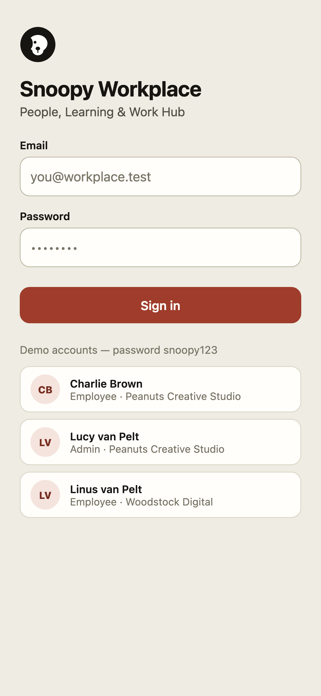

The demo accounts are a prototype affordance and would not ship. What matters is what is *absent*: no organisation picker, no role selector, no "administrator mode" toggle. Identity determines everything downstream, and the phone never asks the user to assert their own authority.

### 4.2 Home — the employee's own obligations


Four counters, then today's work. Nothing here is organisational: courses **I** owe, tasks **I** owe, events **I** am invited to, onboarding **I** have not finished.

**Why this matters:** an employee opening the app should see what they personally owe, not a dashboard of how the workplace as a whole is doing. The second one is HR's question; the first one is theirs.

### 4.3 Courses and required training


Filter chips (All / In Progress / Completed / Pending), progress per course, and a clear marker for anything required with a due date.

### 4.4 Tasks

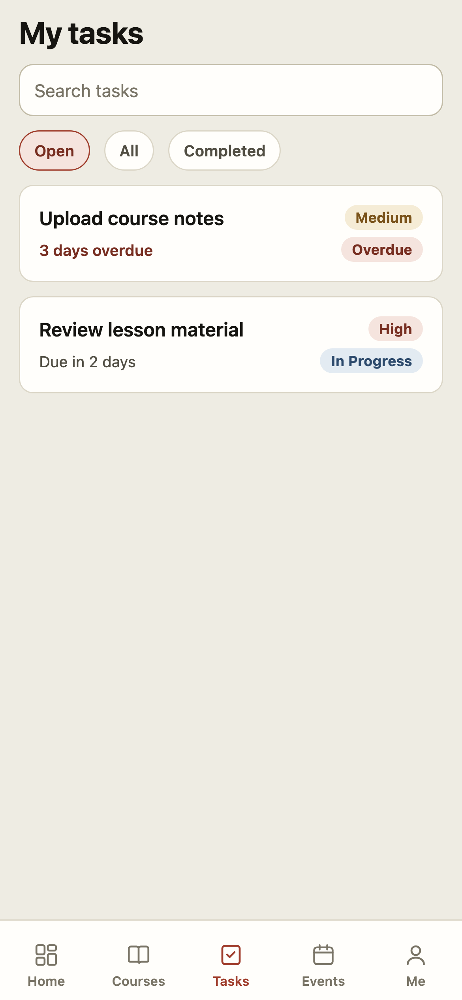

"3 days overdue" is rendered as a state, not a date the reader has to subtract from today. Overdue items sort first.

### 4.5 Events

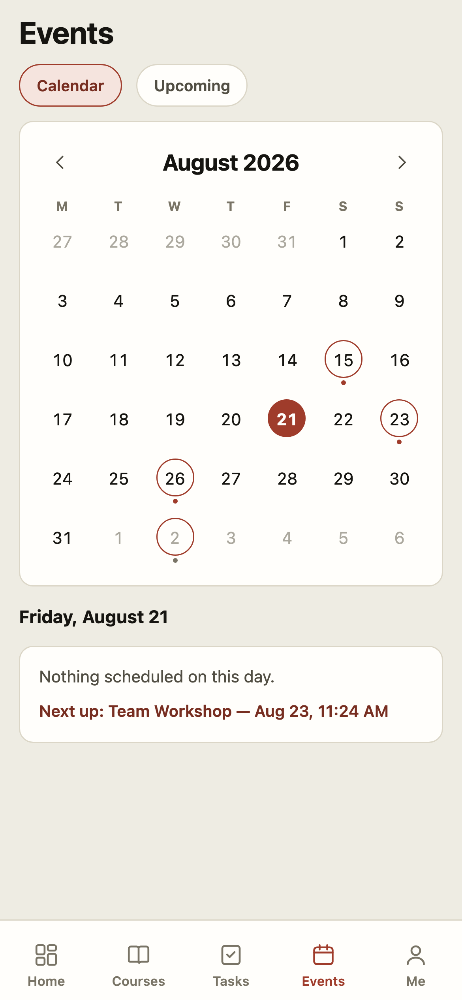

Month grid with marked days, plus an upcoming list. RSVP is one of the few *write* actions the phone is trusted with, because the answer is the user's own and carries no evidentiary weight.

### 4.6 Documents — and the first refusal


Personal and shared documents, and **"Upload a document"** — the phone can put things *in*.

Uploading opens a form rather than a bare file picker: file, name, category, description. A picker alone files everything as an untitled item in "General", which is the difference between a library and a pile.


At the bottom of that screen is the pattern this report recommends most strongly:

> *"Organising shared documents for the whole workplace? This workspace is optimised for desktop. Open Snoopy Workplace on a larger screen to manage this feature."*

The phone does not hide the capability and it does not fail silently. It names the boundary and says where the work lives.

### 4.7 Notifications

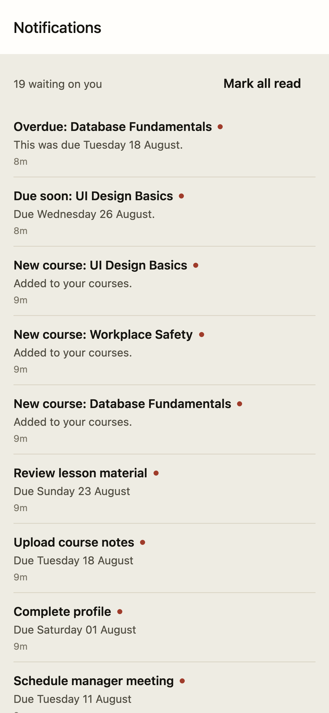

"19 waiting on you." Deadline reminders are raised by database triggers — not by a client, and not by a scheduler that has to be running for correctness. Reminders escalate to the manager when an obligation goes overdue.

### 4.8 Onboarding

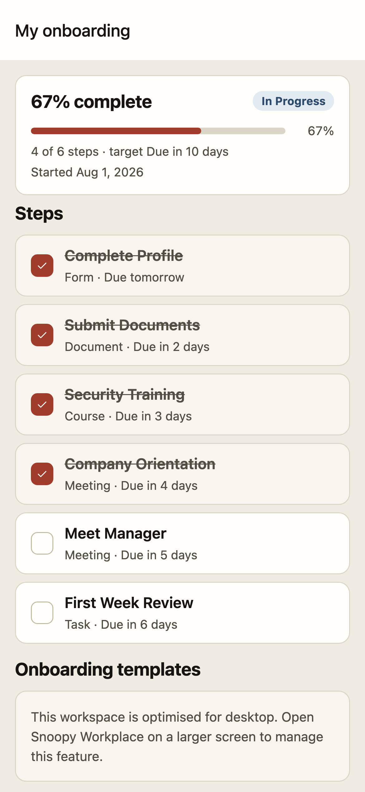

67% complete, 4 of 6 steps, with a target date. Steps can be completed on the phone; the checklist that produced them can only be authored on the desktop.

### 4.9 Profile

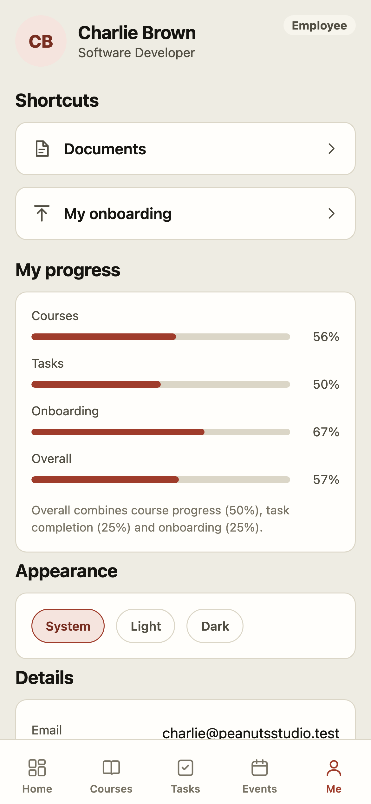

Own progress, theme choice, own details.

### 4.10 Dark mode

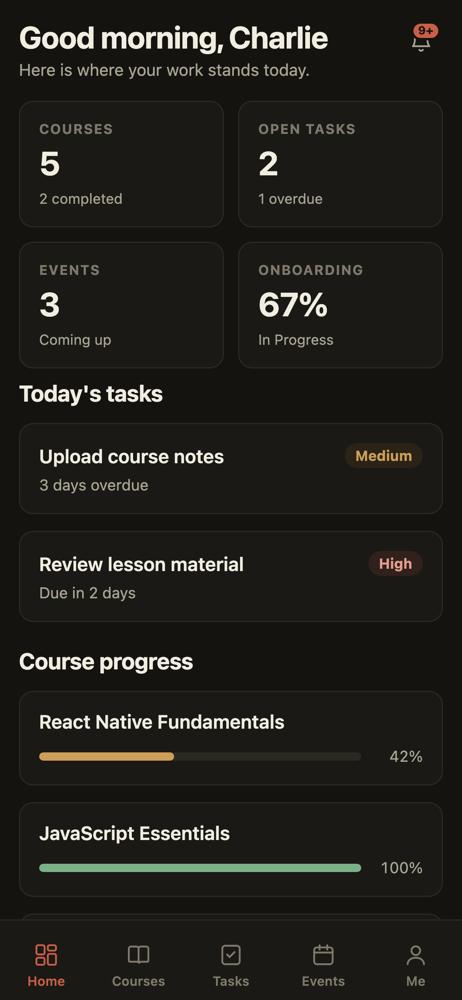
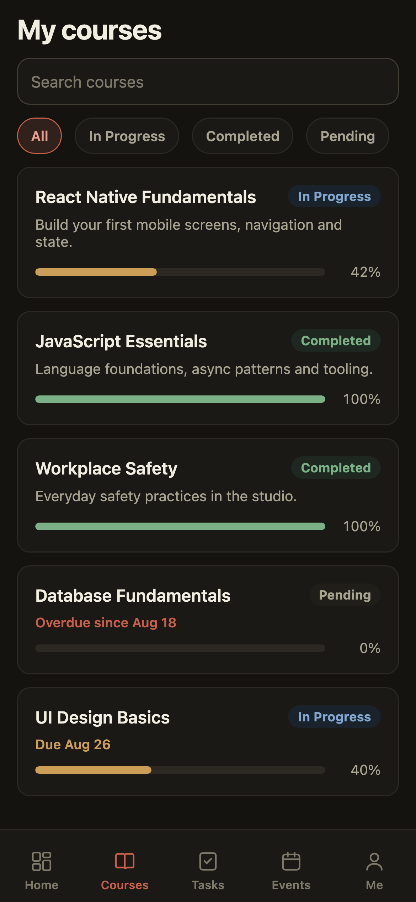

Both clients share one palette, defined once as tokens, with a system / light / dark choice that persists per device.

### 4.11 Handing things in

Three screens carry the phone's real job — let an employee discharge an obligation where they are standing, and leave the judging to HR at a desk.

**Requested from you.** What is owed, outstanding first, each row carrying the instructions, the due date, the template to download, and the button to return the signed copy. A request that was sent back shows the reviewer's reason above that button.


**Add a certificate.** Type chips with the type's own verification guidance, name, issuer, certificate number, issue and expiry dates, and either **Take a photo** or **Choose a file**. Expiry is required when the chosen type demands one, because without it there is no expiry report, no coverage view, and no reminder.


Nothing on that screen sets a status. A submission arrives Pending and stays there until HR decides otherwise on the desktop — and the record then shows who decided, when, and how they checked it.


### 4.12 A manager's team, read-only


A roster with each person's figure, their counts, anything overdue, and the required training still open across the team. There is no action on the screen at all, and the footer says why: approving anything for the team is desktop work.

The shortcut only appears for somebody who actually manages a person — an ordinary employee with reports, not an HR role. That is asked of the database rather than read off a role, because managing somebody is a relationship, not a tier.

### 4.13 HR's half of the phone — a read, not a console

The phone is built for employees, but HR carries the same phone. The question they ask away from a desk is never *"let me approve this"* — it is *"is anything blocking somebody today?"*. One screen answers it.


Blocking count, total waiting, headcount and overall figure; then a count per source; then the blocking items themselves — who, what, why it is stuck, how long it has waited. The home tab carries the same answer in one line, so the glance costs no taps.


Nothing on either screen is actionable, and the footer says why: *"This is a read. Accepting a certificate, a returned document or a completion is done on the desktop, where it is recorded against your name."* This is the same rule as everywhere else in the app, applied to the people who own the product rather than only to the people it chases.

### 4.14 The same app, signed in as a Super Administrator


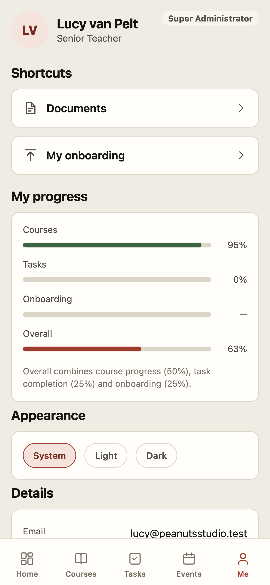

This is the most important pair of screenshots in this report.

Lucy holds the **highest role in the system** — Super Administrator, able on the desktop to edit roles, verify credentials, and configure the organisation. On the phone she sees a personal dashboard and a personal profile. Her badge says "Super Administrator" and her tools are absent.

**Rationale.** Authority is not portable across devices by default. That is a design decision a responsive layout cannot express, and it is the reason a product with real approval steps should ship two clients rather than one.

---

## 5. What the desktop does for HR that the phone does not

### 5.1 HR's queue


One queue, assembled from six separate sources, sorted **blocking-first, then oldest**. The heading is a person's name and a number, not a chart.

Note the batch controls on the first group: "Select all" / "Accept". Note also that the second and third groups have no such controls — those are items that need chasing, not approving, and offering a bulk button for them would be theatre.

This screen replaced seven report tabs. Work that can only be found by remembering to look is work that happens on the days somebody remembers — and in HR, that is the week a deadline quietly passes.

### 5.2 Reports


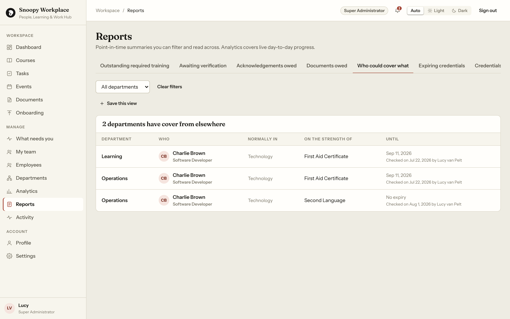

Twelve report tabs, filterable, exportable to CSV. The coverage report answers the rostering question: given the certificates on file and their expiry dates, who is currently able to work where.

This is the "can we still staff that next month" question, answered from records rather than memory.

### 5.3 Analytics

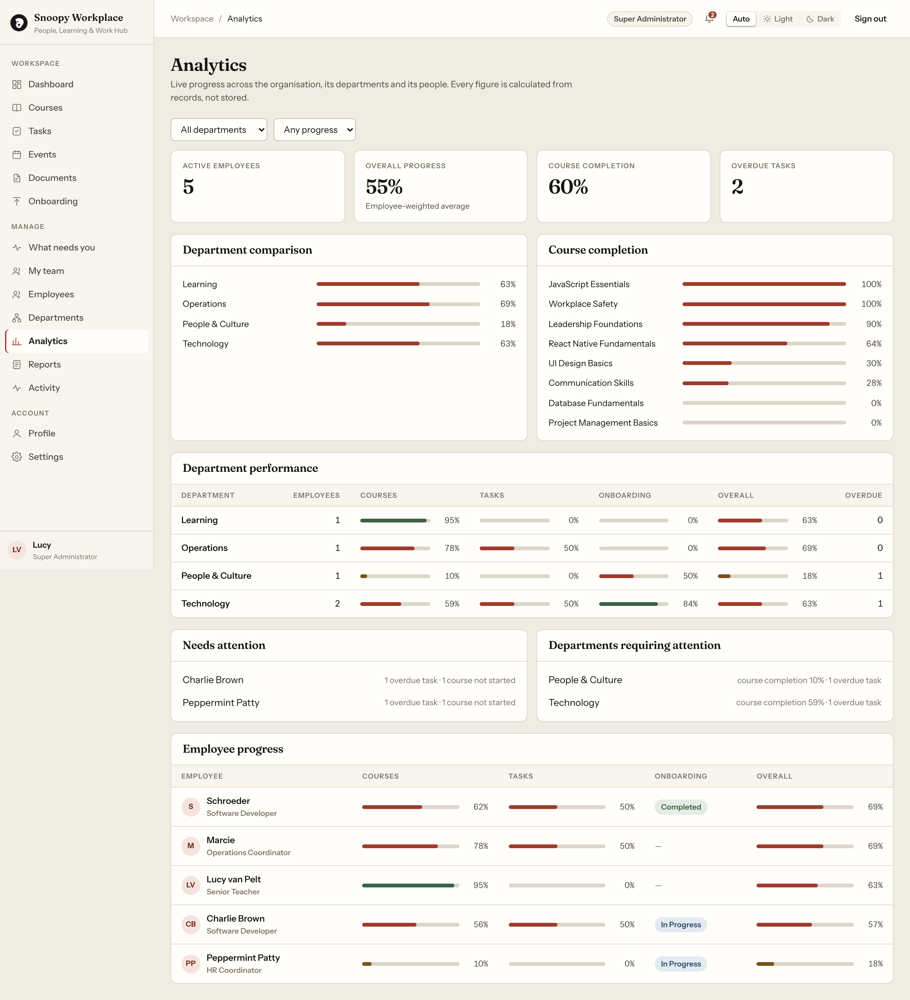

### 5.4 Employees and the per-person record

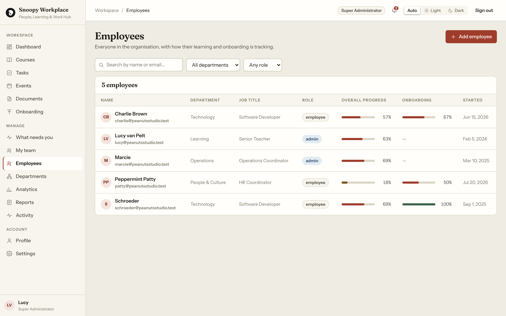

Every person has a **History** tab that merges credentials, document requests, training, onboarding steps, and acknowledgements into one time-ordered record — derived, never stored, so it cannot drift from the rows it describes.

That tab exists because of a specific question: *"what happened with this person, and who approved it?"* Answering it used to mean reading five tabs and holding the dates in your head. When HR has to answer for one person's record, that is the single highest-value screen in the product.

### 5.5 Checklist templates and automation

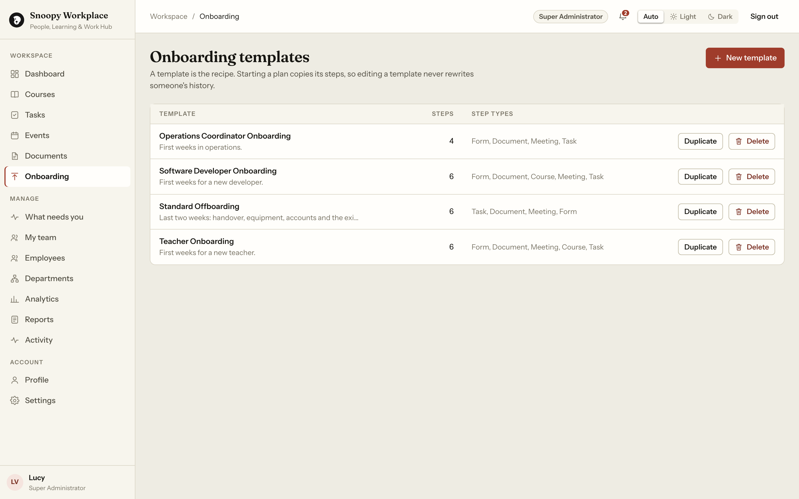

Named checklists, saved as templates, mapped to teams, fired automatically when somebody is added.

### 5.6 Roles and permissions

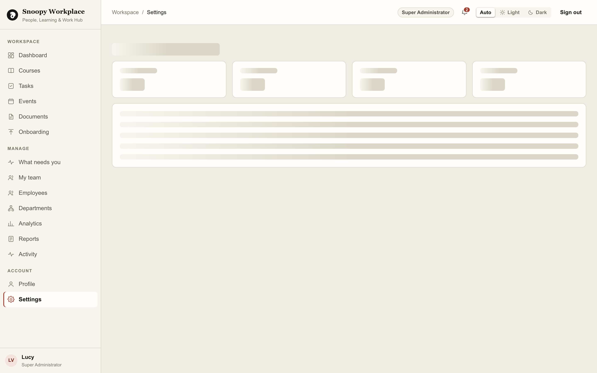

Custom roles, per-operation grants (create / edit / delete are separate), and a rule that an administrator cannot edit their own role unless they are a Super Administrator.

### 5.7 Document management

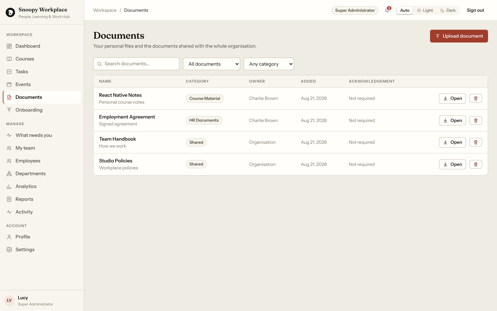

---

## 6. The capability split, in numbers

58 capabilities are defined. Each names a role tier **and** the platforms it may be exercised from.

| | Count | Examples |
|---|---|---|
| **Phone and desktop** | 18 | view courses, update own progress, complete a task, RSVP, view/upload personal documents, **acknowledge a document**, **submit a returned document**, complete an onboarding step, **submit a credential**, view own/team people, summary analytics |
| **Desktop only** | 40 | create/edit/delete anything, assign or bulk-assign, **verify a credential**, **verify training completion**, request documents, manage shared documents, review a team member's submission, manage checklist templates, manage departments, full reports, organisation settings, **role management** |

The shape of that table is the recommendation. Read it as a sentence:

> **On a phone you may say what you did and hand in what you have. You may not decide whether it counts.**

Two entries deserve individual attention because they run against the grain, deliberately:

- **`document.acknowledge` is available on the phone.** Recording that you have read a policy is everyone's obligation, and an acknowledgement you can only give at a desk is a worse record — you get fewer of them, later.
- **`credential.submit` is available on the phone.** A certificate photographed on a phone is the *normal* case. Refusing it just moves the delay.

Meanwhile `credential.verify` and `credential.verify_team` are both desktop-only, even for a manager, because the manager sighting the original is a deliberate, evidence-producing act.

---

## 7. Suggestions

Fifteen suggestions. Each carries:

- **Recommendation** — the position, in one sentence.
- **Rationale** — why it is worth the effort, and what goes wrong without it.
- **In the prototype** — what was actually built to support it, against a live database.
- **Effort** — a rough size, assuming the rest of the stack already exists.

---

### S1 — Ship a companion app, not a shrunken console

**Recommendation.** Build the mobile app as a distinct product with its own navigation, aimed at employees rather than HR, and route devices to it automatically.

**Rationale.** A responsive breakpoint preserves every dangerous action on the smallest, most-interrupted screen. Separation of duty is one of the few controls that survives contact with a busy week, and it survives because it is structural rather than procedural. It also removes an entire class of support ticket — "I approved the wrong record on my phone" — by making the sentence impossible to say.

**In the prototype.** Two clients, one backend. `surfaceFor(userAgent)` decides which app a device may use; a phone on the desktop app is redirected, a computer on the phone app is redirected, and a second hop refuses rather than looping. Screenshots 4.14 and 5.1 show the same Super Administrator account as two entirely different products.


**Effort.** High, but front-loaded. The prototype shares one TypeScript package between both clients, so the domain layer is written once. The cost is a second UI, not a second system.

---

### S2 — Enforce the device rule in three places, not one

**Recommendation.** Hide the control in the client, refuse it in the server action, and reject it at the database. Treat the client rule as cosmetic.

**Rationale.** A hidden button is a suggestion. Anybody with a devtools panel can un-hide it, and any future refactor can accidentally un-hide it for everyone. The client check exists only to avoid showing somebody a button that would fail.

**In the prototype.** Row Level Security is enabled **and forced** on every table, so even the table owner is subject to policy. 36 per-operation policies were generated across 12 tables so that create, edit, and delete are separately grantable. A capability layer (58 keys × role × platform) decides what the UI offers, and a suite of checks confirms every one of the 58 is actually enforced server-side rather than merely hidden.

The subtler lesson, which cost real time: **RLS is row-level, not column-level.** A policy letting a learner update their own assignment row lets them update *every column* of it — including `verified_at`. The fix was `BEFORE UPDATE` trigger guards that silently restore protected columns for anybody who is not a verifier.


**Effort.** Medium. The trigger guards are ~40 lines per table.

---

### S3 — Explain every refusal in place

**Recommendation.** When the phone cannot do something, show the feature, name the boundary, and say where the work lives. Never hide it silently, and never let it fail.

**Rationale.** A missing feature reads as a broken app or a permissions bug, and generates a support ticket. A named boundary reads as a decision and teaches the user the model in one sentence — while keeping the entry point discoverable.

**In the prototype.** Four capability states — `allowed`, `restricted`, `desktop_only`, `admin_only` — each with its own message. Screenshot 4.6 shows the `desktop_only` card sitting under the documents list.


**Effort.** Low.

---

### S4 — Push notifications, backed by a queue that survives a logged-out user

**Recommendation.** Add push for deadline and expiry reminders. Behind it, keep an outbox table written by database triggers, drained by a separate sender.

**Rationale.** The people a reminder most needs to reach are precisely the people who have not opened the app in a fortnight. In-app notifications structurally cannot reach them.

Two design details are worth copying:
- **The database does not send.** Sending is slow, fails in ways a transaction cannot roll back, and would bind a trigger to whichever provider is current. Queue inside the transaction; send outside it.
- **Group per person, not per event.** Four separate "your certificate expires" messages in one minute is how a user learns to mute the sender permanently.

**In the prototype.** Deadline reminders are raised by database triggers and by an idempotent sweep that refuses to raise the same reminder twice — so it is safe to call on every page load and needs no scheduler to be *correct*, only to be *timely*. Overdue items escalate to the learner's manager. Every notification also writes one row to an `email_outbox` table; a provider-agnostic sender drains it, groups by recipient, and posts to a webhook. Unset, it prints instead of sending, so local development never needs mail configured.


**In the prototype, since.** Push was built on the same pattern: a `push_tokens` table holding one row per device, a `push_outbox` written by the same kind of trigger, and a sender that delivers through Expo's push service, forgets a device that reports itself unregistered, and prints instead of sending when push is switched off. Pushes are deliberately *not* grouped the way emails are — a single buzz saying "4 things need you" is unactionable.

**Effort.** Medium. The queue exists; push adds token registration and per-platform delivery.

---

### S5 — Capture credentials with the camera, on the spot

**Recommendation.** Let an employee photograph a certificate and submit it from the phone, with type, issuer, issue date, and expiry captured in the same moment.

**Rationale.** A certificate collected at the moment it exists is a certificate HR actually gets. One that needs a scanner and a desk arrives late, arrives blurry, or does not arrive. Submission carries no authority — it stays a claim until HR verifies it — so there is no reason to restrict it to the desktop.

**In the prototype.** Built and running — screen 4.11. `credential.submit` is phone-enabled; `credential.verify` is not. Certificates carry a type, an issuer, an issue date, an expiry, an attached scan, and a status. Types can be marked **sensitive**, which keeps identity documents away from managers who can otherwise check their own team. Capture is camera-or-file, with the camera permission asked at the moment it is used rather than at launch.


**Effort.** Low-to-medium. Camera capture plus the existing submission form.

---

### S6 — Sign and return documents from the phone

**Recommendation.** Support the full loop on mobile: HR uploads an unsigned document, the employee sees it, downloads it, signs it, returns it; HR accepts it or sends it back **with a reason**.

**Rationale.** A signed agreement is not more valid because it was returned from a laptop. Blocking the return step on mobile does not improve the record — it delays it, and delayed paperwork is the most common way a file ends up incomplete.

The essential detail is the rejection path: sending something back **requires** a written reason. A rejection without one guarantees the document comes back wrong a second time, and that reason field is the most useful thing in the record when a signature is missing three months later.

**In the prototype.** Built and running — screen 4.11. A request carries a title, instructions, an optional template document to download, a due date, the returned document, and a review outcome with a note. Requests can be grouped into named **checklists**, saved as templates, and fired automatically when somebody joins a given team. `document.submit` is phone-enabled; `document.request` and `document.review_team` are not.


**Effort.** Medium. Storage, signed URLs, and a mobile-friendly file picker.

---

### S7 — Give managers a read-only team view on the phone, and nothing more

**Recommendation.** A manager on a phone may see their own team's status. They may not approve anything.

**Rationale.** "Is my team current?" is a legitimate corridor question. "This certificate is acceptable" is not a corridor decision. Splitting *seeing* from *approving* gives managers the mobile value they actually ask for without moving authority onto the small screen.

**In the prototype.** Built and running — screen 4.12. The reporting line is a relationship, not a tier: an ordinary employee who manages somebody can see that person's work, enforced by an `is_manager_of()` helper used by both the RLS policies and the UI. `employee.view_team` is phone-enabled; `credential.verify_team` and `document.review_team` are desktop-only.


**Effort.** Low. The team query and its policy already exist.

---

### S8 — Put a single "what needs you" queue in front of HR

**Recommendation.** Aggregate every pending action into one queue on the desktop, sorted by consequence rather than by age, addressed to the HR user by name.

**Rationale.** Work that can only be found by remembering to look is work that happens on the days somebody remembers — which is an operational risk disguised as a UI complaint. Sorting by consequence rather than recency matters more than it sounds: a certificate submitted this morning that blocks somebody starting tomorrow must outrank a month-old acknowledgement nobody is waiting on.

**In the prototype.** Twelve report tabs existed, seven of which contained work waiting on a human, and nothing answered "what needs me today". The queue draws from six tables, marks each item as blocking or not, sorts blocking-first then oldest, and is scoped by the caller's own session — a manager sees their team, HR sees the workspace, and neither picks a filter. Screenshot 5.1.

The same queue is also readable on the phone (screen 4.13) as counts plus the blocking items, and only readable: the glance is worth having away from a desk, the decision is not.


**Effort.** Medium. It is a read-only aggregation over queries that already exist.

---

### S9 — Batch the approvals that genuinely batch, and refuse to batch the rest

**Recommendation.** Allow multi-select approval where every row ends in the same verdict for the same reason. Keep rejection strictly one at a time.

**Rationale.** HR work arrives in clumps — a cohort finishes the same course on the same afternoon, a checklist goes to a whole department at once. One button per row is fine for three rows and hopeless for thirty, and a tool that is hopeless at thirty is a tool people stop using at fifteen.

But batching must never batch the *evidence*.

**In the prototype.** Accepting a batch of certificates asks **once** how they were checked, then records that method against **every** record individually. Rejection stays per-row, because a reason shared by thirty records is not a reason. Screenshot 5.1 shows the batch controls on the certificates group and their deliberate absence from the two groups that need chasing rather than deciding.


**Effort.** Low.

---

### S10 — Build the per-person timeline before you need it

**Recommendation.** One screen per person merging every recorded event into one time-ordered history, newest first, naming who did what.

**Rationale.** This is the screen HR needs the moment a question is asked about one person. The question is never "show me your credentials table" — it is "what happened with this person, in order, and who signed off". Assembling that by hand across five tabs under time pressure is how details get missed.

Derive it, never store it. A stored timeline drifts out of step with the rows it summarises, and a drifted history is worse than none because it looks authoritative.

**In the prototype.** The History tab merges credentials offered and checked, documents asked for, returned, accepted or sent back, training assigned, completed and confirmed, onboarding steps, and acknowledgements. It runs entirely through the caller's own session, so it can never show a row the reader could not otherwise read, and "by *name*" appears only when somebody other than the subject acted.


**Effort.** Low-to-medium. One query per source, one merge, one sort.

---

### S11 — Timestamp every approval, and record *how* it was checked

**Recommendation.** Store the approver, the approval time, and the verification method. Reset all three automatically whenever the underlying record is edited.

**Rationale.** "Verified" with no account of how is an opinion. "Original sighted, by Lucy van Pelt, 21 Aug 2026" is a record HR can stand behind.

The automatic reset is the part most systems miss: if somebody edits the expiry date or replaces the attached scan **after** approval, the approval no longer refers to what is on file. Silent staleness is the failure mode that goes unnoticed until the one time it matters.

**In the prototype.** Method is a required choice — *original sighted*, *checked against the issuing register*, *copy or photograph only* — captured at approval and stored per record, alongside approver and timestamp. A column guard drops the record back to Pending and clears the approver whenever the title, expiry, or attached document changes. The subject of a record can never write their own verification fields, on any client.


**Effort.** Low.

---

### S12 — Make progress verified, not self-reported

**Recommendation.** Treat "the employee marked it complete" and "HR confirmed it" as two distinct facts, and report on the second.

**Rationale.** A completion figure built from self-reports measures optimism. It is also the number most likely to be quoted upward, which makes it the worst place in the product to be loose. Keeping the two facts separate costs one column and makes the reported figure mean something.

**In the prototype.** Completion and verification are separate columns with separate grants. An "awaiting verification" queue exists, and completion statistics distinguish claimed from confirmed. The learner can set the first and, thanks to the column guard in S2, structurally cannot set the second.


**Effort.** Low.

---

### S13 — Ship the mobile app as a PWA first, native second

**Recommendation.** Build with React Native + React Native Web (Expo), deploy the web build immediately as an installable PWA, and take the app stores later from the same codebase.

**Rationale.** Every screenshot in section 4 is the *web* build of the React Native app running in a mobile viewport. That is the whole argument: one codebase, instant distribution, no review queue, no install friction for an employee who needs it today — and the native path stays open because the code is already React Native.

**In the prototype.** Expo SDK 52 with `react-native-web`, a web manifest, icons, and a service worker; the same source runs on a device through Expo and in a browser through Metro.


**Effort.** Low, if chosen at the start. Expensive to retrofit later.

---

### S14 — Share the domain layer, never the screens

**Recommendation.** One package holding types, validation, services, and the capability rules, imported by both clients. Two entirely separate UI layers.

**Rationale.** The failure mode of two clients is divergence: the desktop thinks a certificate is expiring, the phone thinks it is current, and both are reading the same database. Sharing the domain layer makes that impossible for the logic that matters, while sharing *nothing* about the screens keeps each client appropriate to its device. The specific thing to avoid is each client deciding independently what "current" means — that divergence is invisible until somebody is turned away from work the platform said they could do.

**In the prototype.** `packages/shared` holds the services, the validation, the 58-key capability matrix, and `surfaceFor()` — the function both clients call to decide which app a device belongs to, which is exactly what stops the two apps disagreeing and bouncing a user between them forever.


**Effort.** Low, as a starting decision.

---

### S15 — Give HR a glance on the phone, and no buttons

**Recommendation.** Put HR's queue on the phone as a summary — blocking count, a count per source, and the blocking items themselves — with every action removed.

**Rationale.** The rule "the phone is for employees" is right about *authority* and wrong if it is read as "HR should not open the app". HR away from a desk still needs one number: is anything held up. Refusing them that number does not protect the record; it just means the question is answered late, from a laptop, by somebody who has already gone home.

The distinction that makes this safe is between *reading* and *deciding*. A count cannot be wrong in a way that damages a record. An approval can, which is why it carries a name, a timestamp and a recorded method — and why it stays on the desktop.

**In the prototype.** Built and running — screen 4.13. The phone runs the same `loadWorklist()` as the desktop queue, gated on a capability that was already phone-enabled, and renders it inert: no accept, no reject, no assign. The home tab carries the same answer in one line so the glance costs no taps.

**Effort.** Low. The aggregation already exists; this is a second, smaller view of it.

---

## 8. What should NOT go on the phone

Stated positively, because omitting these is a feature and will be asked about.

| Not on the phone | Why |
|---|---|
| Verifying or approving anything | Separation of duty. The claimant and the judge should not share a device. *Reading* what is waiting is fine, and useful — see S15. |
| Role and permission management | The highest-consequence, lowest-frequency screen in any product. |
| Bulk assignment | Irreversible at scale, and a mis-tap is a mis-tap for 200 people. |
| Organisation settings | Same reasoning; also nobody has ever needed to do this urgently. |
| Full reporting and CSV export | A wide table on a narrow screen is not a report, it is a rumour. |
| Deleting shared records | The prototype separates create / edit / delete as distinct grants precisely so that "can edit" never silently implies "can destroy". |
| Editing your own role | Guarded at the database in the prototype; a Super Administrator only. |

---

## 9. Suggested delivery sequence

| Phase | Scope | Why this order |
|---|---|---|
| **1** | Companion app shell: sign-in, own obligations, own credentials, own documents, device routing, in-place refusals | Delivers value to the largest user group — employees — first, and establishes the boundary before any authority exists to leak. |
| **2** | Capture: camera credential submission, document sign-and-return, acknowledgements | The highest-value mobile actions, and all of them are claims rather than decisions. |
| **3** | Reminders: push notifications on the outbox pattern, escalation to managers | Reaches the users who are not logging in — the whole point of the exercise. |
| **4** | Manager read-only team view | Small, frequently requested, no authority moved. |
| **5** | Desktop-side: the "what needs you" queue, per-person timeline, batch approval with per-record evidence | These make the phone's output *usable* by HR. Building them first would be building the back half of a pipeline with no front. |

---

## 10. Risks and open questions

1. **Domain-specific fields are out of scope of this prototype.** The record *shapes* here — timestamped approvals, recorded verification methods, immutable-once-approved records, per-person history — are the general-purpose ones. Which fields a particular workplace requires is a question for the HR team that owns the policy, and should be settled before schema work.
2. **Offline is unaddressed.** Every screen in this prototype assumes connectivity. Employees working on remote sites do not have that. Offline capture with deferred sync is a genuine piece of engineering, not a setting, and it should be scoped explicitly rather than assumed.
3. **People who work for more than one organisation.** One person may need one login across several. The prototype is multi-organisation at the database level, but a person belongs to exactly one.
4. **Document storage and retention.** Signed documents held on a phone-uploaded path need a retention policy and a deletion path that survives an employee leaving — which is HR's decision to make, not the schema's.
5. **Push notification fatigue.** The grouping rule in S4 is not a nicety. Get it wrong once and the channel is dead permanently.

---

## Appendix A — How these screenshots were produced

Live captures from the running prototype against a seeded local database, taken over the Chrome DevTools Protocol at a 390 × 844 iPhone viewport (3× scale) for the phone, and 1440 × 900 (2× scale) for the desktop. No mockups, no retouching. The mobile captures required an iPhone user agent — with a desktop user agent, the mobile app redirects to the desktop workspace, which is the device rule in section 3 doing its job.

## Appendix B — Verification

The prototype ships 350+ end-to-end assertions across 20 check groups, run against a live database and live server-rendered pages, with no mocking anywhere. They cover permission enforcement, role separation, privilege-escalation attempts through the API, notification delivery, deadline chasing, document request loops, credential verification and expiry, device routing, tampered tokens, and progress propagation.

One finding from that suite is worth reporting because it generalises: a feature can be entirely broken while every test passes, if no test exercises it the way a person does. Employee creation in the prototype had never worked — a missing grant on one table — and was invisible because every check created people directly in SQL as the database owner. The one action needing elevated rights was the one action never exercised through the path a user takes.

**Test what the user does, not what the database allows.**
